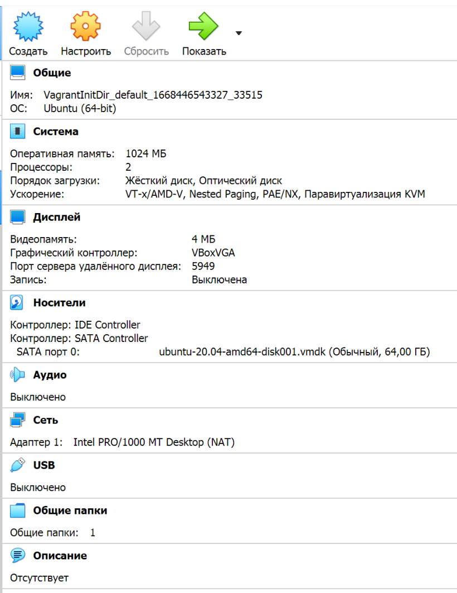

# Домашнее задание к занятию "3.1. Работа в терминале. Лекция 1"

## Задание

1. С помощью базового файла конфигурации запустите Ubuntu 20.04 в VirtualBox посредством Vagrant:

	* Создайте директорию, в которой будут храниться конфигурационные файлы Vagrant. В ней выполните `vagrant init`. Замените содержимое Vagrantfile по умолчанию следующим:

		```bash
		Vagrant.configure("2") do |config|
			config.vm.box = "bento/ubuntu-20.04"
		end
		```

	* Выполнение в этой директории `vagrant up` установит провайдер VirtualBox для Vagrant, скачает необходимый образ и запустит виртуальную машину.

	* `vagrant suspend` выключит виртуальную машину с сохранением ее состояния (т.е., при следующем `vagrant up` будут запущены все процессы внутри, которые работали на момент вызова suspend), `vagrant halt` выключит виртуальную машину штатным образом.

1. Ознакомьтесь с графическим интерфейсом VirtualBox, посмотрите как выглядит виртуальная машина, которую создал для вас Vagrant, какие аппаратные ресурсы ей выделены. Какие ресурсы выделены по-умолчанию?




1. Ознакомьтесь с возможностями конфигурации VirtualBox через Vagrantfile: [документация](https://www.vagrantup.com/docs/providers/virtualbox/configuration.html). Как добавить оперативной памяти или ресурсов процессора виртуальной машине?

**Увеличить эти показатели в Vagrantfile:**

    config.vm.provider "virtualbox" do |v|
    v.memory = 1024
    v.cpus = 2
    end


3. Команда `vagrant ssh` из директории, в которой содержится Vagrantfile, позволит вам оказаться внутри виртуальной машины без каких-либо дополнительных настроек. Попрактикуйтесь в выполнении обсуждаемых команд в терминале Ubuntu.

4. Ознакомьтесь с разделами `man bash`, почитайте о настройках самого bash:
* какой переменной можно задать длину журнала `history`, и на какой строчке manual это описывается?
  
   
723:       HISTFILESIZE - максимальное число строк в файле истории для сохранения


681:       HISTSIZE - число команд для сохранения


   * что делает директива `ignoreboth` в bash?

ignoreboth это сокращение для 2х директив ignorespace and ignoredups, 
    ignorespace - не сохранять команды начинающиеся с пробела, 
    ignoredups - не сохранять команду, если такая уже имеется в истории


5. В каких сценариях использования применимы скобки `{}` и на какой строчке `man bash` это описано?

{} - зарезервированные слова, список, в т.ч. список команд команд в отличии от "(...)" исполнятся в текущем инстансе, 
используется в различных условных циклах, условных операторах, или ограничивает тело функции, 
В командах выполняет подстановку элементов из списка , если упрощенно то  цикличное выполнение команд с подстановкой 
например mkdir ./DIR_{A..Z} - создаст каталоги сименами DIR_A, DIR_B и т.д. до DIR_Z

Строка 149:


6. С учётом ответа на предыдущий вопрос, как создать однократным вызовом `touch` 100000 файлов? Получится ли аналогичным образом создать 300000? Если нет, то почему?

100000 - да

    touch {1..100000}.txt
300000 - нет

    -bash: /usr/bin/touch: Argument list too long

7. В man bash поищите по `/\[\[`. Что делает конструкция `[[ -d /tmp ]]`

проверяет условие у -d /tmp и возвращает ее статус (0 или 1), наличие каталога /tmp

Например в скрипте можно так:

    if [[ -d /tmp ]]
    then
        echo "каталог есть"
    else
        echo "каталога нет"
    fi

8. Сделайте так, чтобы в выводе команды `type -a bash` первым стояла запись с нестандартным путем, например bash is ... 
Используйте знания о просмотре существующих и создании новых переменных окружения, обратите внимание на переменную окружения PATH 

    ```bash
    bash is /tmp/new_path_directory/bash
    bash is /usr/local/bin/bash
    bash is /bin/bash
    ```

    (прочие строки могут отличаться содержимым и порядком)
    В качестве ответа приведите команды, которые позволили вам добиться указанного вывода или соответствующие скриншоты.

       vagrant@vagrant:~$ mkdir /tmp/new_path_dir/
       vagrant@vagrant:~$ cp /bin/bash /tmp/new_path_dir/
       vagrant@vagrant:~$ PATH=/tmp/new_path_dir/:$PATH
       vagrant@vagrant:~$ type -a bash
       bash is /tmp/new_path_dir/bash
       bash is /usr/bin/bash
       bash is /bin/bash

9. Чем отличается планирование команд с помощью `batch` и `at`?

Команда at, например, получает список команд (введенный с клавиатуры или находящийся в файле) и запускает их в определенное в команде время. Команда batch подобна команде at, но запускается не в определенное пользователем время, а когда система сама решит, что загрузка позволяет ей запустить дополнительные процессы.

10. Завершите работу виртуальной машины чтобы не расходовать ресурсы компьютера и/или батарею ноутбука.

        vagrant suspend

*В качестве решения дайте ответы на вопросы свободной форме* 

---

### Правила приема домашнего задания

- В личном кабинете отправлена ссылка на .md файл в вашем репозитории.

### Критерии оценки

Зачет - выполнены все задания, ответы даны в развернутой форме, приложены соответствующие скриншоты и файлы проекта, в выполненных заданиях нет противоречий и нарушения логики.

На доработку - задание выполнено частично или не выполнено, в логике выполнения заданий есть противоречия, существенные недостатки. 