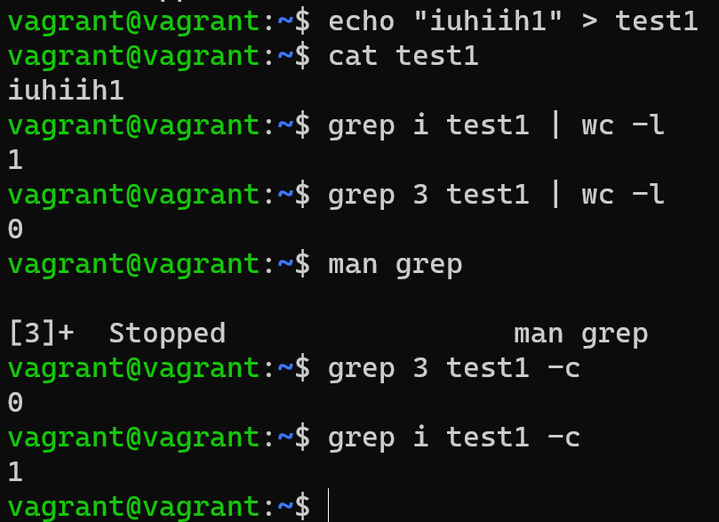
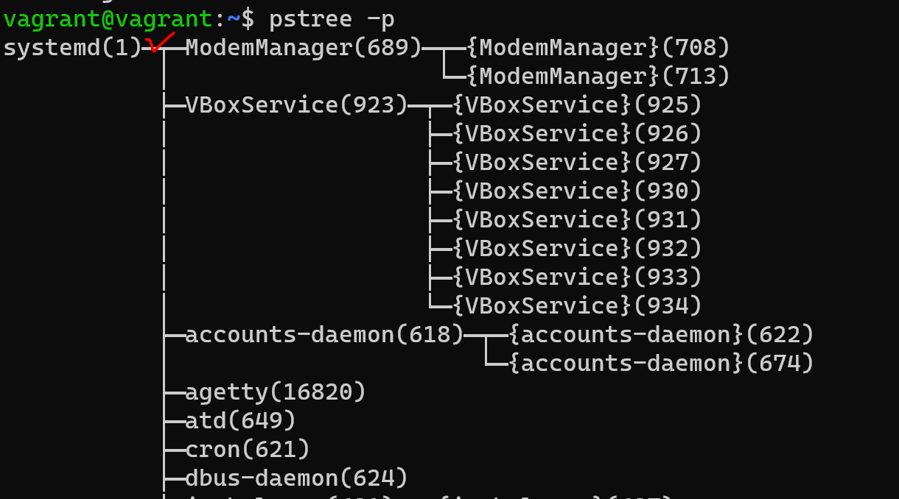
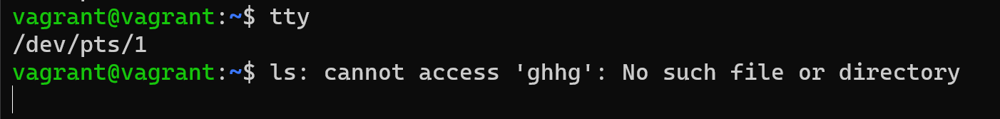
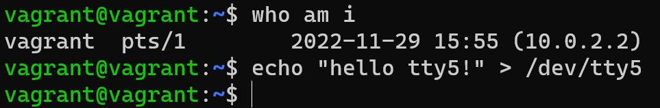
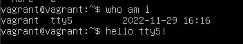
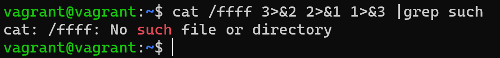
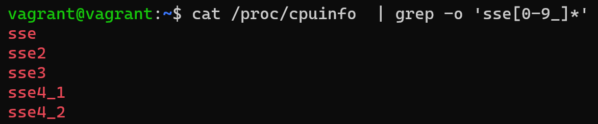
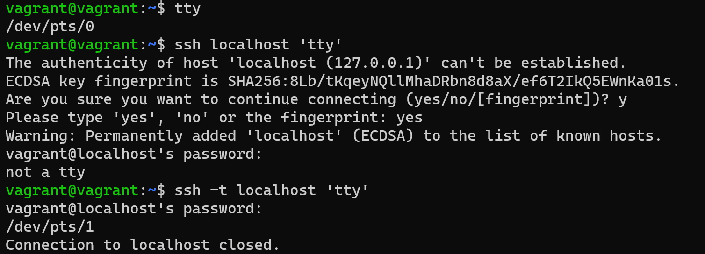
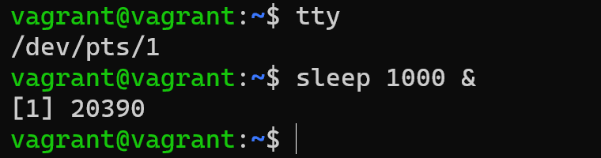
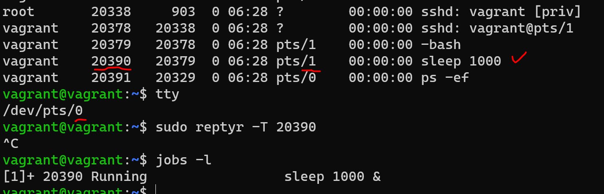

# **Задание**

1. Какого типа команда cd? Попробуйте объяснить, почему она именно такого типа: опишите ход своих мыслей, если считаете, что она могла бы быть другого типа.

**Ответ: Это не утилита, ее нет в файловой системе. 
    Это встроенная команда Bash и меняет текущую папку только для оболочки, в которой выполняется**

2. Какая альтернатива без pipe команде grep <some_string> <some_file> | wc -l?

    Подсказка:

    Ознакомьтесь с документом о других подобных некорректных вариантах использования pipe.

**Ответ: grep <some_string> <some_file> -c**

3. Какой процесс с PID 1 является родителем для всех процессов в вашей виртуальной машине Ubuntu 20.04?

    
**Ответ: systemd**

4. Как будет выглядеть команда, которая перенаправит вывод stderr ls на другую сессию терминала?

Сессия первая:

Сессия вторая:

5. Получится ли одновременно передать команде файл на stdin и вывести ее stdout в другой файл? Приведите работающий пример.

6. Получится ли, находясь в графическом режиме, вывести данные из PTY в какой-либо из эмуляторов TTY? Сможете ли вы наблюдать выводимые данные?

7. Выполните команду bash 5>&1. К чему она приведет? Что будет, если вы выполните echo netology > /proc/$$/fd/5? Почему так происходит?

**Ответ: bash 5>&1 - Создаст дескриптор 5 и перенатправит его в stdout
    echo netology > /proc/$$/fd/5 - выведет в терминале "netology", потому что echo отправляет netology в fd 5**

8. Получится ли в качестве входного потока для pipe использовать только stderr команды, не потеряв при этом отображение stdout на pty?

    Напоминаем: по умолчанию через pipe передается только stdout команды слева от | на stdin команды справа. Это можно сделать, поменяв стандартные потоки местами через промежуточный новый дескриптор, который вы научились создавать в предыдущем вопросе.

**3>&2 - новый дескриптор перенаправили в stderr**

**2>&1 - stderr перенаправили в stdout** 

**1>&3 - stdout - перенаправили в в новый дескриптор**

9. Что выведет команда cat /proc/$$/environ? Как еще можно получить аналогичный по содержанию вывод? 

**Ответ: Будут выведены переменные окружения. 
    Еще способы:
    env
    printenv**

10. Используя man, опишите что доступно по адресам /proc/<PID>/cmdline, /proc/<PID>/exe.

**Ответ: 
    /proc/<PID>/cmdline — содержит параметры командной строки, переданные на этапе запуска процесса
    /proc/<PID>/exe — является символьной ссылкой на исполненный бинарный файл**

11. Узнайте, какую наиболее старшую версию набора инструкций SSE поддерживает ваш процессор с помощью /proc/cpuinfo.

**Ответ: SSE 4_2**

12. При открытии нового окна терминала и vagrant ssh создается новая сессия и выделяется pty.
Это можно подтвердить командой tty, которая упоминалась в лекции 3.2.
Однако:

        vagrant@netology1:~$ ssh localhost 'tty'
        not a tty
Почитайте, почему так происходит, и как изменить поведение.

**Ответ: Это сделано для правильной работы в скриптах. Если сразу выполнить команду на удалённом сервере через ssh, sshd это поймёт, и запускаемые команды тоже, поэтому они не будут спрашивать что-то у пользователя, а вывод очистят от лишних данных.**

**Например, если в интерактивном режиме программа задала бы пользователю вопрос и ждала ответа "yes/no", при запуске через ssh она этого делать не станет.**

**Изменить поведение можно добавив флаг -t при вызове ssh.**

13. Бывает, что есть необходимость переместить запущенный процесс из одной сессии в другую. Попробуйте сделать это, воспользовавшись reptyr. Например, так можно перенести в screen процесс, который вы запустили по ошибке в обычной SSH-сессии.

14. sudo echo string > /root/new_file не даст выполнить перенаправление под обычным пользователем, так как перенаправлением занимается процесс shell'а, который запущен без sudo под вашим пользователем. Для решения данной проблемы можно использовать конструкцию echo string | sudo tee /root/new_file. Узнайте? что делает команда tee и почему в отличие от sudo echo команда с sudo tee будет работать.

**Ответ: tee делает одновременно вывод в файл, указанный в качестве параметра, и в stdout. Команда получает вывод из stdin, перенаправленный через пайп от stdout команды echo, и так как она запущена от sudo, получает права на запись в файл.**