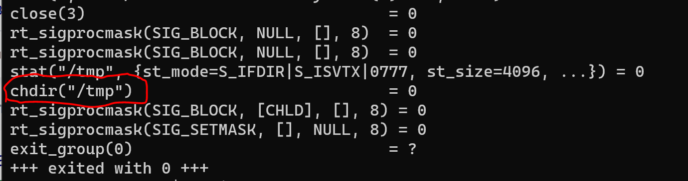
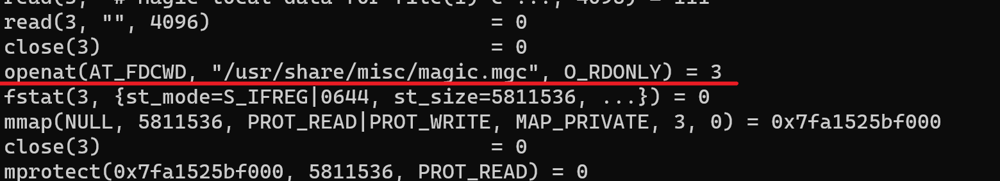
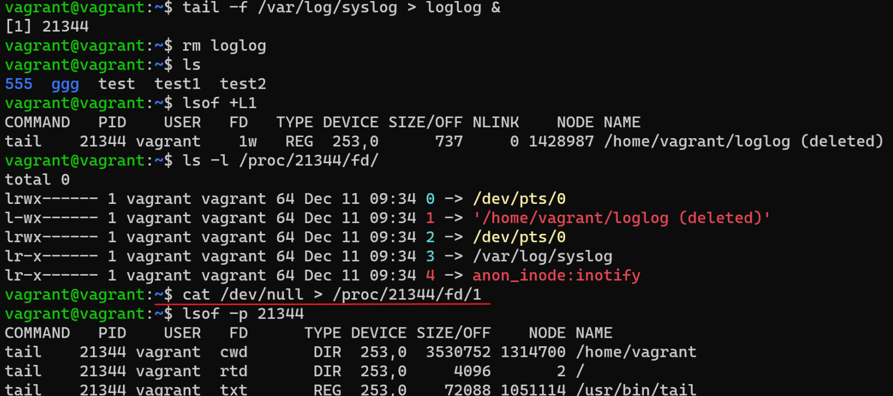
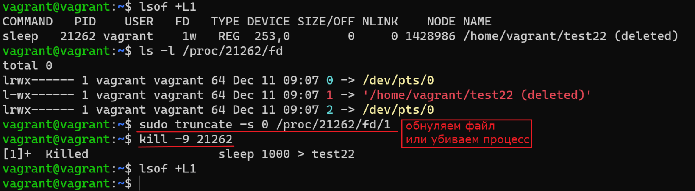
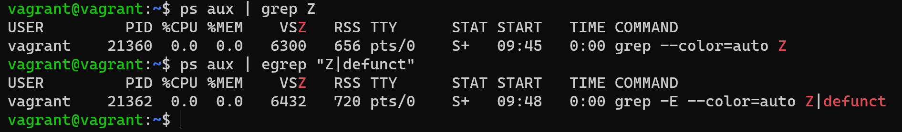
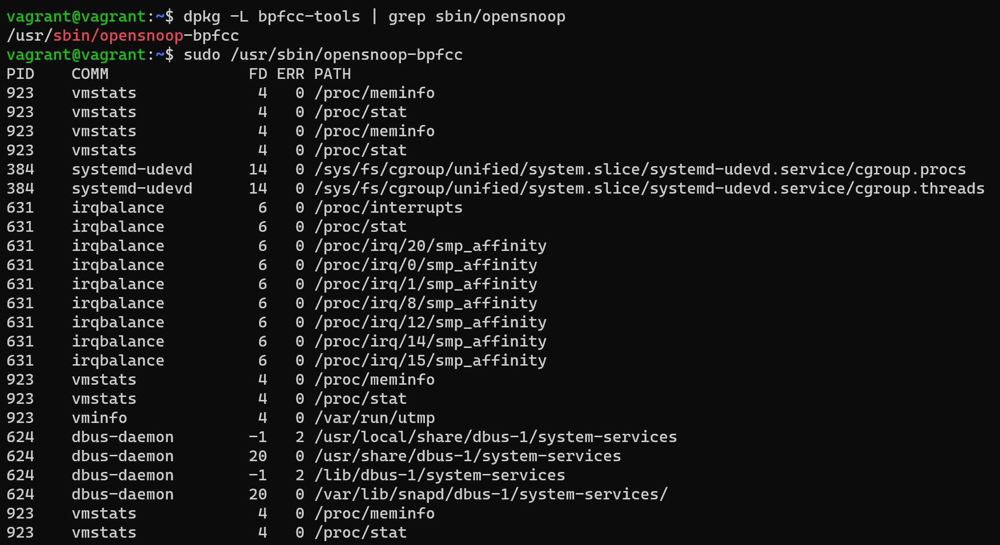
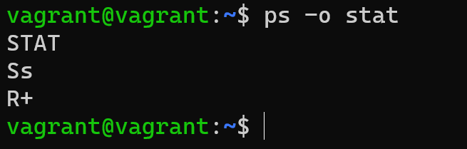

## Задание

1. Какой системный вызов делает команда `cd`? 

    В прошлом ДЗ мы выяснили, что `cd` не является самостоятельной  программой, это `shell builtin`, поэтому запустить `strace` непосредственно на `cd` не получится. Тем не менее, вы можете запустить `strace` на `/bin/bash -c 'cd /tmp'`. В этом случае вы увидите полный список системных вызовов, которые делает сам `bash` при старте. 

    Вам нужно найти тот единственный, который относится именно к `cd`. Обратите внимание, что `strace` выдаёт результат своей работы в поток stderr, а не в stdout.



2. Попробуйте использовать команду `file` на объекты разных типов в файловой системе. Например:
    ```bash
    vagrant@netology1:~$ file /dev/tty
    /dev/tty: character special (5/0)
    vagrant@netology1:~$ file /dev/sda
    /dev/sda: block special (8/0)
    vagrant@netology1:~$ file /bin/bash
    /bin/bash: ELF 64-bit LSB shared object, x86-64
    ```
    Используя `strace` выясните, где находится база данных `file`, на основании которой она делает свои догадки.



3. Предположим, приложение пишет лог в текстовый файл. Этот файл оказался удален (deleted в lsof), однако возможности сигналом сказать приложению переоткрыть файлы или просто перезапустить приложение – нет. Так как приложение продолжает писать в удаленный файл, место на диске постепенно заканчивается. Основываясь на знаниях о перенаправлении потоков предложите способ обнуления открытого удаленного файла (чтобы освободить место на файловой системе).

Способ 1:



Способ 2 и 3:



4. Занимают ли зомби-процессы какие-то ресурсы в ОС (CPU, RAM, IO)?

**Ответ: нет**



5. В iovisor BCC есть утилита `opensnoop`:
    ```bash
    root@vagrant:~# dpkg -L bpfcc-tools | grep sbin/opensnoop
    /usr/sbin/opensnoop-bpfcc
    ```
    На какие файлы вы увидели вызовы группы `open` за первую секунду работы утилиты? Воспользуйтесь пакетом `bpfcc-tools` для Ubuntu 20.04. Дополнительные [сведения по установке](https://github.com/iovisor/bcc/blob/master/INSTALL.md).



6. Какой системный вызов использует `uname -a`? Приведите цитату из man по этому системному вызову, где описывается альтернативное местоположение в `/proc`, где можно узнать версию ядра и релиз ОС.

**Системный вызов: uname()**

**Цитата: Part of the utsname information is also accessible via /proc/sys/kernel/{ostype, hostname, osrelease, version, domainname}.**

7. Чем отличается последовательность команд через `;` и через `&&` в bash? Например:
    ```bash
    root@netology1:~# test -d /tmp/some_dir; echo Hi
    Hi
    root@netology1:~# test -d /tmp/some_dir && echo Hi
    root@netology1:~#
    ```
    Есть ли смысл использовать в bash `&&`, если применить `set -e`?

**&& -  условный оператор,**

**;  - разделитель последовательных команд,**

**set -e - прерывает сессию при любом ненулевом значении исполняемых команд в конвеере кроме последней.**
**в случае &&  вместе с set -e не имеет смысла, так как при ошибке , выполнение команд прекратится.**

8. Из каких опций состоит режим bash `set -euxo pipefail` и почему его хорошо было бы использовать в сценариях?

       `-e` Немедленный выход, если команда завершается с ненулевым статусом. 
       `-u` При подстановке обрабатывать неустановленные переменные как ошибку.
       `-x` Печатать команды и их аргументы по мере их выполнения. 
       `-o option-pipefail` возвращаемое значение конвейера - это статус последней команды для выхода с ненулевым статусом или ноль,
        если ни одна команда не завершилась с ненулевым статусом.
        Для сценария увеличивает детальность логирования. 

Прервет сценарий при возникновении ошибки, кроме завершающей команды.

9. Используя `-o stat` для `ps`, определите, какой наиболее часто встречающийся статус у процессов в системе. В `man ps` ознакомьтесь (`/PROCESS STATE CODES`) что значат дополнительные к основной заглавной буквы статуса процессов. Его можно не учитывать при расчете (считать S, Ss или Ssl равнозначными).
  


**Чаще Ss неактивные процессы; и R+ выполняющиеся в группе приоритетных.**

**D - uninterruptible sleep (непрерываемый сон, обычно во время IO операций);**

**R - running и runnable (исполняется или ожидает исполнения);**

**S - interruptible sleep (обычный спящий процесс, который может быть
прерван, ожидает какого-то события);**

**T - остановлен сигналом управления задачами;**

**Z - упомянутый ранее зомби-процесс.**