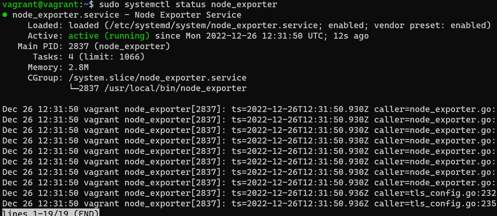
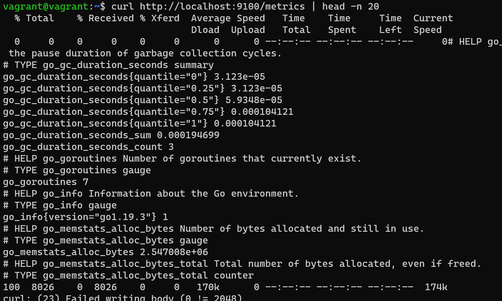
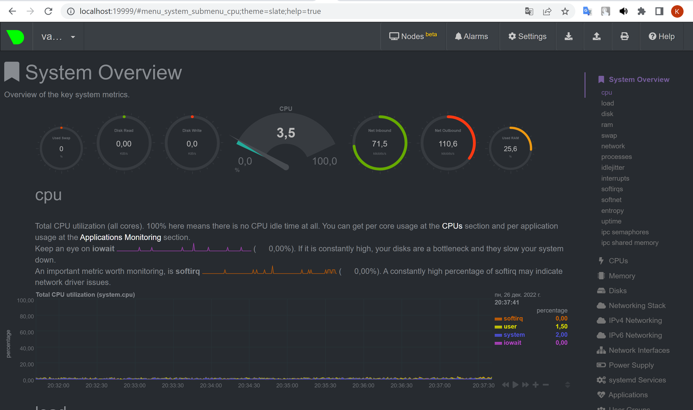
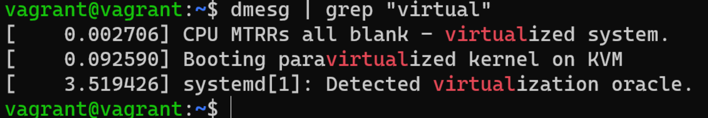
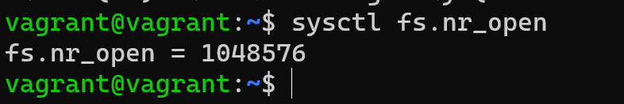
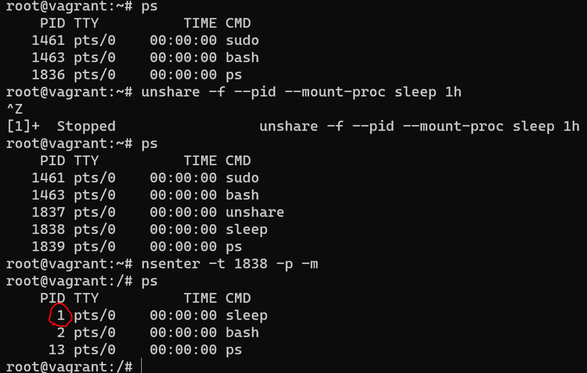
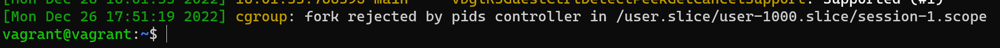

## Задание

1. На лекции мы познакомились с [node_exporter](https://github.com/prometheus/node_exporter/releases). В демонстрации его исполняемый файл запускался в background. Этого достаточно для демо, но не для настоящей production-системы, где процессы должны находиться под внешним управлением. Используя знания из лекции по systemd, создайте самостоятельно простой [unit-файл](https://www.freedesktop.org/software/systemd/man/systemd.service.html) для node_exporter:

    * поместите его в автозагрузку,
    * предусмотрите возможность добавления опций к запускаемому процессу через внешний файл (посмотрите, например, на `systemctl cat cron`),
    * удостоверьтесь, что с помощью systemctl процесс корректно стартует, завершается, а после перезагрузки автоматически поднимается.

Шаги:
Скачать через `wget` [node_exporter](https://github.com/prometheus/node_exporter/releases) и распаковать с помощью `tar zxvf`

Скопировать исполняемый файл `sudo cp node_exporter /usr/local/bin/`

Создаем пользователя nodeusr (без создания домашнего каталога и с выключенным shell) `sudo useradd --no-create-home --shell /bin/false nodeusr`

Задаем владельца для исполняемого файла: `sudo chown -R nodeusr:nodeusr /usr/local/bin/node_exporter`

Создаем unit-файл node_exporter.service в systemd: `sudo nano /etc/systemd/system/node_exporter.service`

Внутри прописываем: 

      [Unit]
      Description=Node Exporter Service
      After=network.target

      [Service]
      User=nodeusr
      Group=nodeusr
      Type=simple
      ExecStart=/usr/local/bin/node_exporter $OPTIONS
      ExecReload=/bin/kill -HUP $MAINPID
      Restart=on-failure

      [Install]
      WantedBy=multi-user.target

Перечитываем конфигурацию systemd: `systemctl daemon-reload`

Разрешаем автозапуск: `systemctl enable node_exporter`

Запускаем службу: `systemctl start node_exporter`

Смотрим статус: `systemctl status node_exporter`



Перезагружаем, проверяем еще раз. У меня все работает.


2. Ознакомьтесь с опциями node_exporter и выводом `/metrics` по-умолчанию. Приведите несколько опций, которые вы бы выбрали для базового мониторинга хоста по CPU, памяти, диску и сети.

Метрик много, ознакомилась:



Чтобы увидеть все доступные флаги конфигурации:	`./node_exporter -h`

Опции можно включить с помощью флага `--collector.<имя>` в `node_exporter.service` в поле `ExecStart`. Опции, включенные по умолчанию, можно отключить, указав флаг `--no-collector.<имя>`. Чтобы включить только некоторые определенные опции `--collector.disable-defaults --collector.<имя>`.

`cpu` - предоставляет статистику процессора

`meminfo` - предоставляет статистику памяти

`netstat` - предоставляет сетевую статистику из /proc/net/netstat. Это та же информация, что и netstat -s

`filesystem` - предоставляет статистику файловой системы, такую как используемое дисковое пространство.

Пример:

         ExecStart=/usr/local/bin/node_exporter  --collector.disable-defaults --collector.netstat --collector.meminfo --collector.cpu --collector.filesystem
3. Установите в свою виртуальную машину [Netdata](https://github.com/netdata/netdata). Воспользуйтесь [готовыми пакетами](https://packagecloud.io/netdata/netdata/install) для установки (`sudo apt install -y netdata`). 
   
   После успешной установки:
    * в конфигурационном файле `/etc/netdata/netdata.conf` в секции [web] замените значение с localhost на `bind to = 0.0.0.0`,
    * добавьте в Vagrantfile проброс порта Netdata на свой локальный компьютер и сделайте `vagrant reload`:

    ```bash
    config.vm.network "forwarded_port", guest: 19999, host: 19999
    ```

    После успешной перезагрузки в браузере *на своем ПК* (не в виртуальной машине) вы должны суметь зайти на `localhost:19999`. Ознакомьтесь с метриками, которые по умолчанию собираются Netdata и с комментариями, которые даны к этим метрикам.

Всё получилось:



4. Можно ли по выводу `dmesg` понять, осознает ли ОС, что загружена не на настоящем оборудовании, а на системе виртуализации?

Да, можно:



5. Как настроен sysctl `fs.nr_open` на системе по-умолчанию? Определите, что означает этот параметр. Какой другой существующий лимит не позволит достичь такого числа (`ulimit --help`)?
   


Параметр означает максимальное количество дескрипторов файлов, которое может выделить процесс. Значение по умолчанию - 1024х1024 (1048576), чего должно хватить для большинства машин. Фактический лимит зависит от лимита ресурсов RLIMIT_NOFILE.

RLIMIT_NOFILE — указывает значение, которое больше максимального номера дескриптора файла, который может быть открыт этим процессом.

Также максимальное количество открытых файлов для процесса мы можем увидеть через ulimit. Есть жесткий и мягкий лимиты максимально открытых дескрипторов. Мягкий лимит:

$ ulimit -Sn 1024 "жесткий" лимит, устанавливается администратором. Пользователь имеет право увеличить "мягкий" лимит до значения "жесткого":

$ ulimit -Hn 1048576

6. Запустите любой долгоживущий процесс (не `ls`, который отработает мгновенно, а, например, `sleep 1h`) в отдельном неймспейсе процессов; покажите, что ваш процесс работает под PID 1 через `nsenter`. Для простоты работайте в данном задании под root (`sudo -i`). Под обычным пользователем требуются дополнительные опции (`--map-root-user`) и т.д.



7. Найдите информацию о том, что такое `:(){ :|:& };:`. Запустите эту команду в своей виртуальной машине Vagrant с Ubuntu 20.04 (**это важно, поведение в других ОС не проверялось**). Некоторое время все будет "плохо", после чего (минуты) – ОС должна стабилизироваться. Вызов `dmesg` расскажет, какой механизм помог автоматической стабилизации.  
Как настроен этот механизм по-умолчанию, и как изменить число процессов, которое можно создать в сессии?

`:(){ :|:& };:` - это fork-бомба — вредоносная или ошибочно написанная программа, бесконечно создающая свои копии (системным вызовом fork()), которые обычно также начинают создавать свои копии и т. д.

Выполнение такой программы может вызывать большую нагрузку вычислительной системы или даже отказ в обслуживании вследствие нехватки системных ресурсов (дескрипторов процессов, памяти, процессорного времени).

`dmesg` сообщает:



Здесь мы видим что сработал механизм сgroups - это способ ограничить ресурсы внутри конкретной cgroup(контрольной группы процессов).
Параметры по умолчанию можно глянуть командой `ulimit -a`.

А назначить новые параметры можно здесь: `/etc/security/limits.conf`.
