## Задание

1. Узнайте о [sparse](https://ru.wikipedia.org/wiki/%D0%A0%D0%B0%D0%B7%D1%80%D0%B5%D0%B6%D1%91%D0%BD%D0%BD%D1%8B%D0%B9_%D1%84%D0%B0%D0%B9%D0%BB) (разряженных) файлах.

Разреженные – это специальные файлы, которые с большей эффективностью используют файловую систему, они не позволяют ФС занимать свободное дисковое пространство носителя, когда разделы не заполнены. То есть, «пустое место» будет задействовано только при необходимости. Пустая информация в виде нулей, будет храниться в блоке метаданных ФС. Поэтому, разреженные файлы изначально занимают меньший объем носителя, чем их реальный объем.
Этот тип поддерживает большинство файловый систем: BTRFS, NILFS, ZFS, NTFS, ext2, ext3, ext4, XFS, JFS, ReiserFS, Reiser4, UFS, Rock Ridge, UDF, ReFS, APFS, F2FS.

2. Могут ли файлы, являющиеся жесткой ссылкой на один объект, иметь разные права доступа и владельца? Почему?

Жесткая ссылка это копия объекта, наследующая его права, владельца и группу. Имеет тот же inode что и оригинальный файл. Поэтому разных владельцев и разные права оригинал и хардлинк иметь не могут.

3. Сделайте `vagrant destroy` на имеющийся инстанс Ubuntu. Замените содержимое Vagrantfile следующим:

    ```ruby
    path_to_disk_folder = './disks'

    host_params = {
        'disk_size' => 2560,
        'disks'=>[1, 2],
        'cpus'=>2,
        'memory'=>2048,
        'hostname'=>'sysadm-fs',
        'vm_name'=>'sysadm-fs'
    }
    Vagrant.configure("2") do |config|
        config.vm.box = "bento/ubuntu-20.04"
        config.vm.hostname=host_params['hostname']
        config.vm.provider :virtualbox do |v|

            v.name=host_params['vm_name']
            v.cpus=host_params['cpus']
            v.memory=host_params['memory']

            host_params['disks'].each do |disk|
                file_to_disk=path_to_disk_folder+'/disk'+disk.to_s+'.vdi'
                unless File.exist?(file_to_disk)
                    v.customize ['createmedium', '--filename', file_to_disk, '--size', host_params['disk_size']]
                end
                v.customize ['storageattach', :id, '--storagectl', 'SATA Controller', '--port', disk.to_s, '--device', 0, '--type', 'hdd', '--medium', file_to_disk]
            end
        end
        config.vm.network "private_network", type: "dhcp"
    end
    ```

    Данная конфигурация создаст новую виртуальную машину с двумя дополнительными неразмеченными дисками по 2.5 Гб.

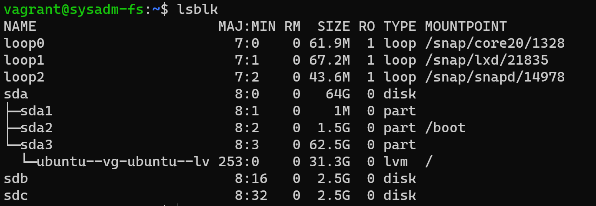

4. Используя `fdisk`, разбейте первый диск на 2 раздела: 2 Гб, оставшееся пространство.

       vagrant@sysadm-fs:~$ sudo fdisk /dev/sdb

       Welcome to fdisk (util-linux 2.34).
       Changes will remain in memory only, until you decide to write them.
       Be careful before using the write command.

       Device does not contain a recognized partition table.
       Created a new DOS disklabel with disk identifier 0xa01ab029.

       Command (m for help): F
       Unpartitioned space /dev/sdb: 2.51 GiB, 2683305984 bytes, 5240832 sectors
       Units: sectors of 1 * 512 = 512 bytes
       Sector size (logical/physical): 512 bytes / 512 bytes

       Start     End Sectors  Size
       2048 5242879 5240832  2.5G

       Command (m for help): n
       Partition type
       p   primary (0 primary, 0 extended, 4 free)
       e   extended (container for logical partitions)
       Select (default p): p
       Partition number (1-4, default 1):
       First sector (2048-5242879, default 2048):
       Last sector, +/-sectors or +/-size{K,M,G,T,P} (2048-5242879, default 5242879): +2G

       Created a new partition 1 of type 'Linux' and of size 2 GiB.

       Command (m for help): n
       Partition type
       p   primary (1 primary, 0 extended, 3 free)
       e   extended (container for logical partitions)
       Select (default p): p
       Partition number (2-4, default 2):
       First sector (4196352-5242879, default 4196352):
       Last sector, +/-sectors or +/-size{K,M,G,T,P} (4196352-5242879, default 5242879):

       Created a new partition 2 of type 'Linux' and of size 511 MiB.

       Command (m for help): w
       The partition table has been altered.
       Calling ioctl() to re-read partition table.
       Syncing disks.

5. Используя `sfdisk`, перенесите данную таблицу разделов на второй диск.

        vagrant@sysadm-fs:~$ sudo sfdisk -d /dev/sdb > sdb.dump
        vagrant@sysadm-fs:~$ sudo sfdisk /dev/sdc < sdb.dump

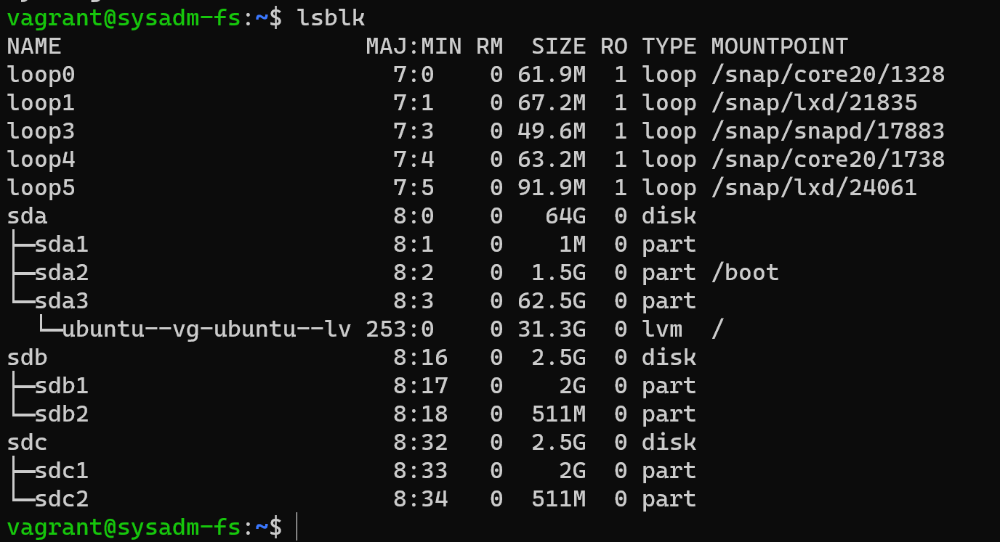

7. Соберите `mdadm` RAID1 на паре разделов 2 Гб.

       vagrant@sysadm-fs:~$ sudo mdadm --create /dev/md0 --level=1 --raid-devices=2 /dev/sd[bc]1

8. Соберите `mdadm` RAID0 на второй паре маленьких разделов.

       vagrant@sysadm-fs:~$ sudo mdadm --create /dev/md1 --level=0 --raid-devices=2 /dev/sd[bc]2

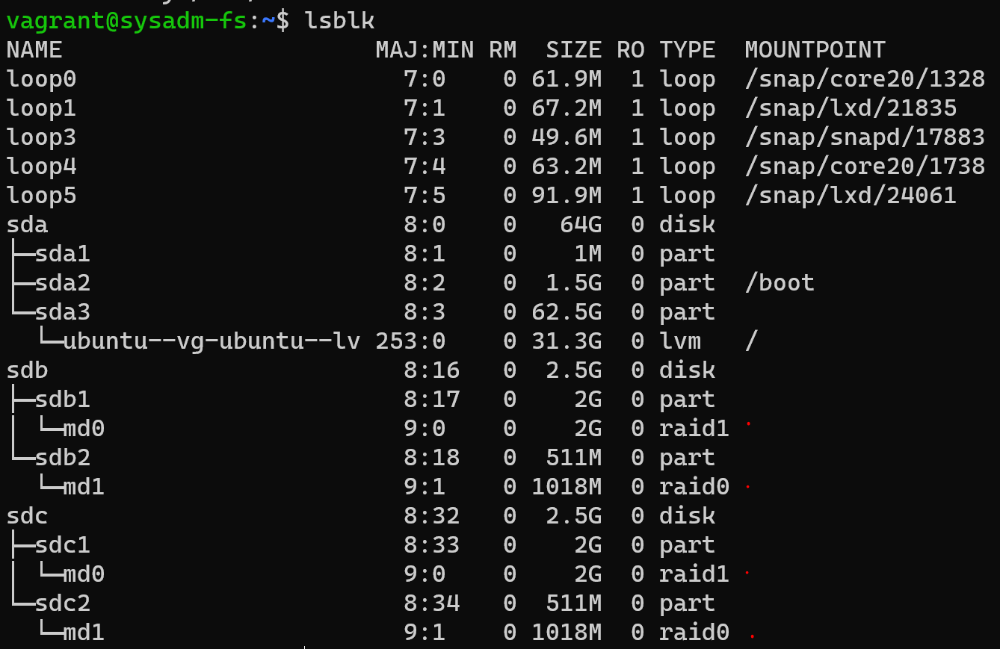


9. Создайте 2 независимых PV на получившихся md-устройствах.


    vagrant@sysadm-fs:~$ sudo pvcreate /dev/md0

    vagrant@sysadm-fs:~$ sudo pvcreate /dev/md1

10. Создайте общую volume-group на этих двух PV.


    vagrant@sysadm-fs:~$ sudo vgcreate netology /dev/md0 /dev/md1

11. Создайте LV размером 100 Мб, указав его расположение на PV с RAID0.


    vagrant@sysadm-fs:~$ sudo lvcreate -L 100m -n netology-lv netology /dev/md1


12. Создайте `mkfs.ext4` ФС на получившемся LV.


    vagrant@sysadm-fs:~$ sudo mkfs.ext4 -L netology-ext4 -m 1 /dev/mapper/netology-netology--lv

13. Смонтируйте этот раздел в любую директорию, например, `/tmp/new`.


    vagrant@sysadm-fs:~$ sudo mount /dev/mapper/netology-netology--lv /tmp/new/

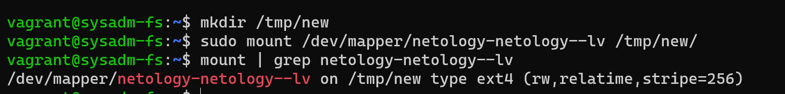

14. Поместите туда тестовый файл, например `wget https://mirror.yandex.ru/ubuntu/ls-lR.gz -O /tmp/new/test.gz`.

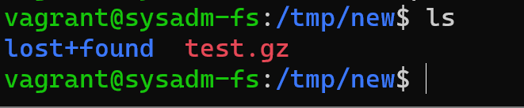

15. Прикрепите вывод `lsblk`.

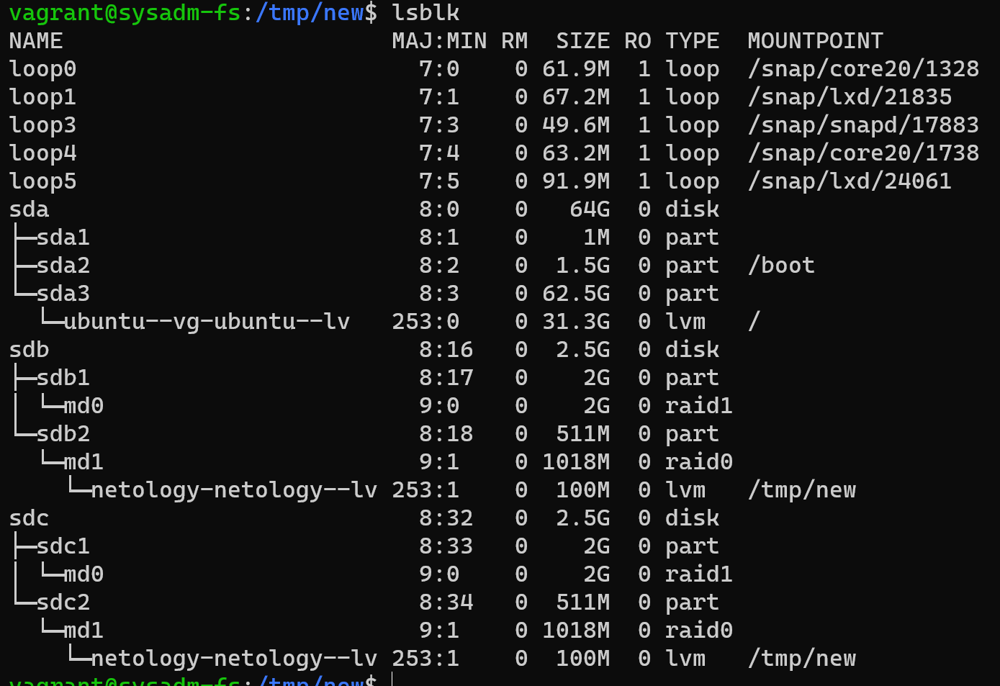

16. Протестируйте целостность файла:

     ```bash
     root@vagrant:~# gzip -t /tmp/new/test.gz
     root@vagrant:~# echo $?
     0
     ```

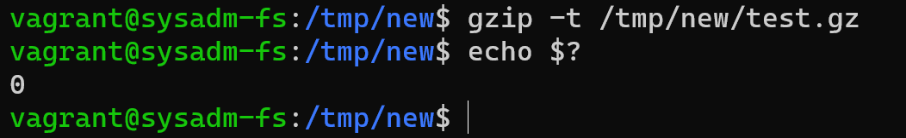

17. Используя pvmove, переместите содержимое PV с RAID0 на RAID1.

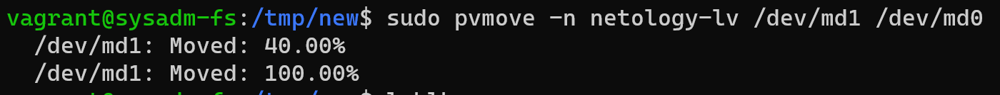

18. Сделайте `--fail` на устройство в вашем RAID1 md.

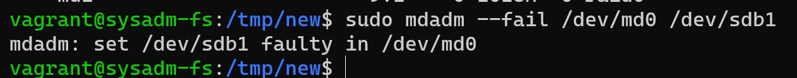

19. Подтвердите выводом `dmesg`, что RAID1 работает в деградированном состоянии.

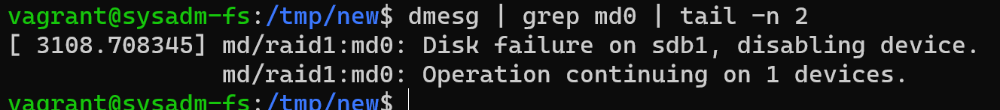

20. Протестируйте целостность файла, несмотря на "сбойный" диск он должен продолжать быть доступен:

     ```bash
     root@vagrant:~# gzip -t /tmp/new/test.gz
     root@vagrant:~# echo $?
     0
     ```

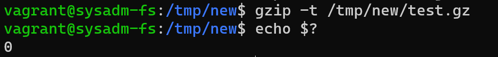

21. Погасите тестовый хост, `vagrant destroy`.

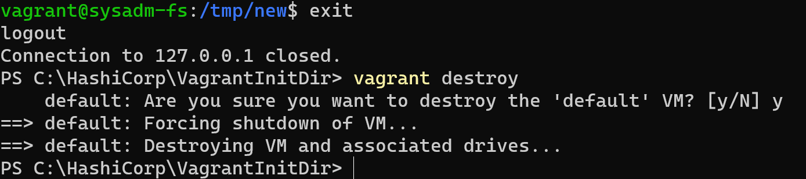