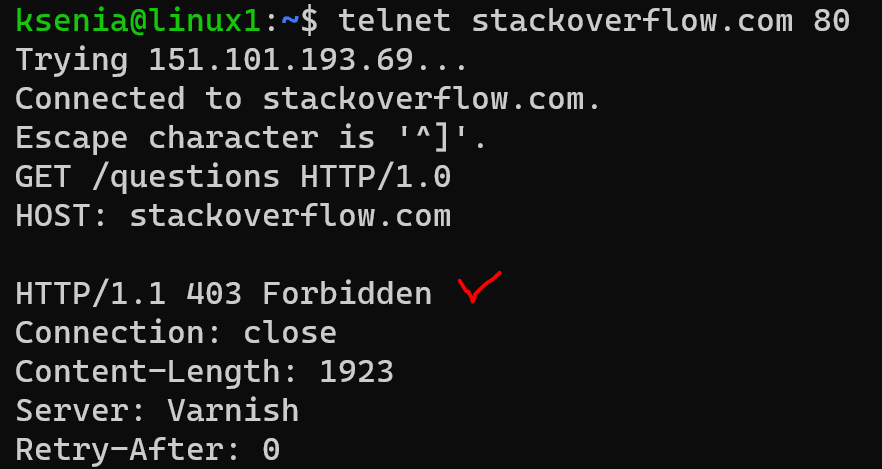
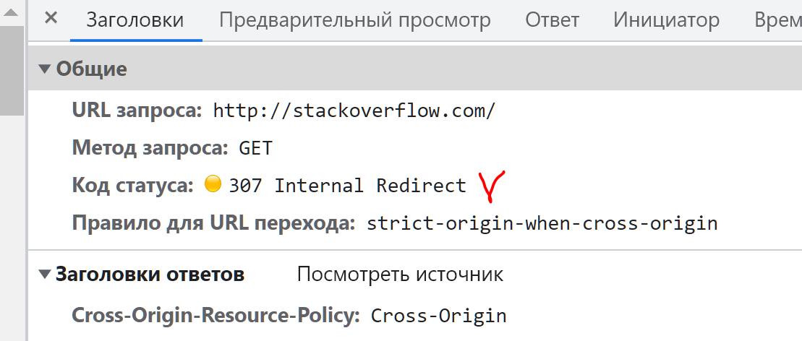
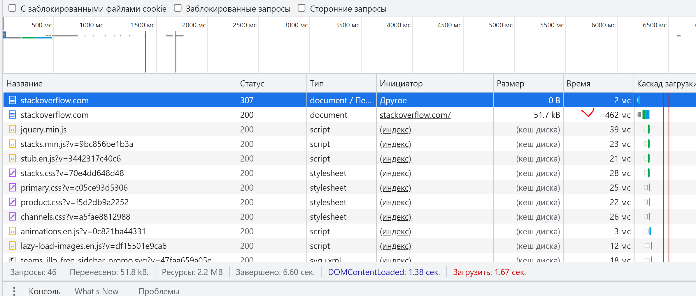
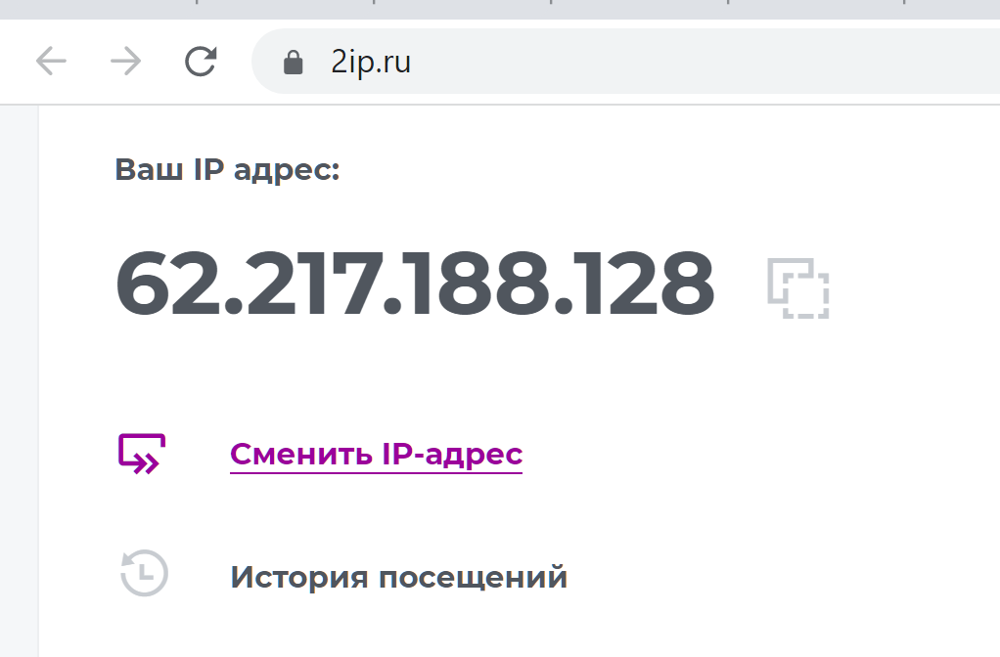
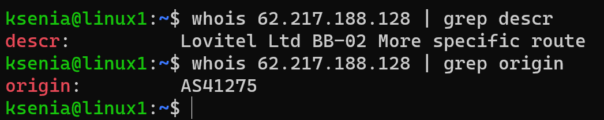
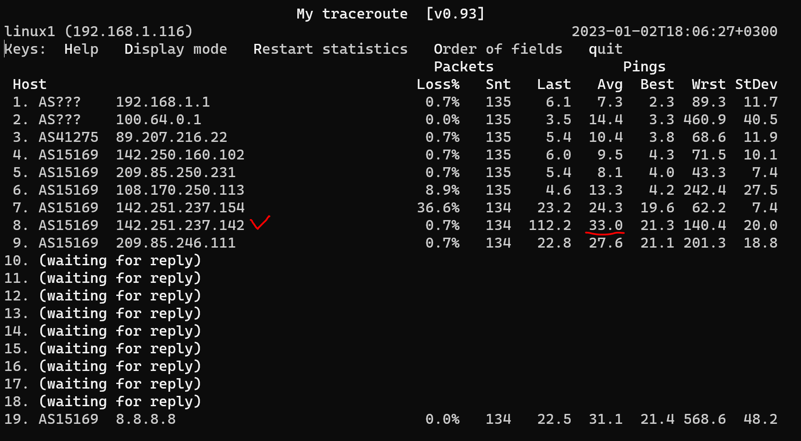
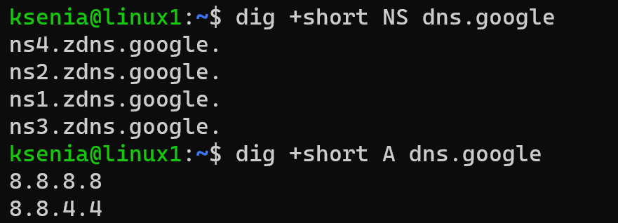

## Задание

1. Работа c HTTP через телнет.
- Подключитесь утилитой телнет к сайту stackoverflow.com
`telnet stackoverflow.com 80`
- Отправьте HTTP запрос
```bash
GET /questions HTTP/1.0
HOST: stackoverflow.com
[press enter]
[press enter]
```
*В ответе укажите полученный HTTP код, что он означает?*



HTTP 403 Forbidden — стандартный код ответа HTTP, означающий, что доступ к запрошенному ресурсу запрещен. Сервер понял запрос, но не выполнит его.


2. Повторите задание 1 в браузере, используя консоль разработчика F12.
- откройте вкладку `Network`
- отправьте запрос http://stackoverflow.com
- найдите первый ответ HTTP сервера, откройте вкладку `Headers`
- укажите в ответе полученный HTTP код


  

HTTP код перенаправления 307: временно перемещен

- проверьте время загрузки страницы, какой запрос обрабатывался дольше всего?
- приложите скриншот консоли браузера в ответ.

Страница полностью загрузилась за 6.60 сек. Самый долгий запрос - начальная загрузка страницы 462 мс

  


3. Какой IP адрес у вас в интернете?


   

4. Какому провайдеру принадлежит ваш IP адрес? Какой автономной системе AS? Воспользуйтесь утилитой `whois`


   

5. Через какие сети проходит пакет, отправленный с вашего компьютера на адрес 8.8.8.8? Через какие AS? Воспользуйтесь утилитой `traceroute`


    ksenia@linux1:~$ traceroute -An 8.8.8.8
    traceroute to 8.8.8.8 (8.8.8.8), 30 hops max, 60 byte packets
    1  192.168.1.1 [*]  3.036 ms  2.998 ms  2.977 ms
    2  100.64.0.1 [*]  7.644 ms  7.625 ms  7.608 ms
    3  89.207.216.22 [AS41275]  5.822 ms 89.207.216.24 [AS41275]  5.804 ms 89.207.216.22 [AS41275]  5.792 ms 
    4  142.250.160.102 [AS15169]  6.979 ms  6.945 ms  6.921 ms
    5  * * *
    6  108.170.250.33 [AS15169]  6.935 ms 108.170.250.129 [AS15169]  9.544 ms 108.170.250.33 [AS15169]  9.396 ms
    7  108.170.250.99 [AS15169]  9.339 ms 108.170.250.34 [AS15169]  4.936 ms 108.170.250.66 [AS15169]  5.063 ms
    8  72.14.234.20 [AS15169]  20.719 ms 142.251.237.156 [AS15169]  20.677 ms *
    9  72.14.235.69 [AS15169]  20.600 ms 209.85.254.6 [AS15169]  22.604 ms 74.125.253.109 [AS15169]  36.824 ms
    10  142.250.56.221 [AS15169]  22.145 ms 142.250.238.181 [AS15169]  22.091 ms 142.250.233.27 [AS15169]  22.054 ms
    11  * * *
    12  * * *
    13  * * *
    14  * * *
    15  * * *
    16  * * *
    17  * * *
    18  * 8.8.8.8 [AS15169]  26.040 ms *

AS проходит AS41275, AS15169

6. Повторите задание 5 в утилите `mtr`. На каком участке наибольшая задержка - delay?



Есть небольшие задержки на 8 хопе

7. Какие DNS сервера отвечают за доменное имя dns.google? Какие A записи? Воспользуйтесь утилитой `dig`



8. Проверьте PTR записи для IP адресов из задания 7. Какое доменное имя привязано к IP? Воспользуйтесь утилитой `dig`


