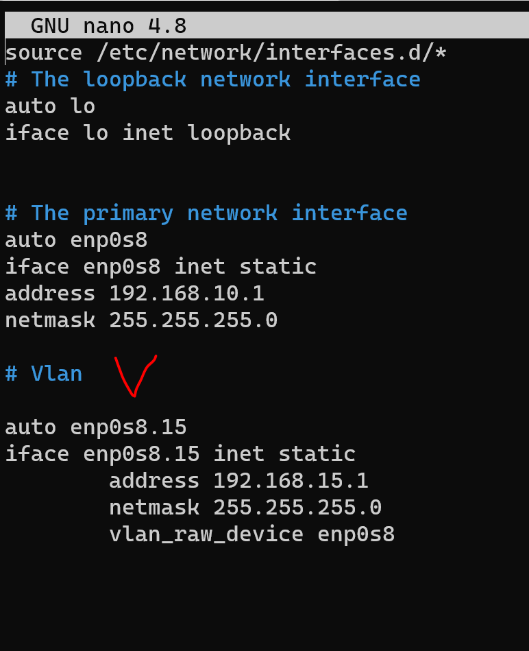
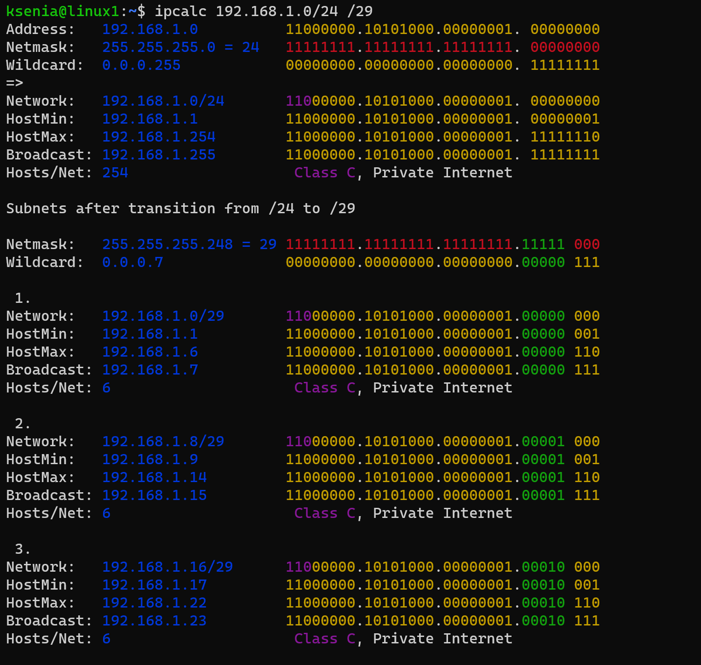

## Задание

1. Проверьте список доступных сетевых интерфейсов на вашем компьютере. Какие команды есть для этого в Linux и в Windows?

Linux:

       ip link show
       ip a 
       ip -c -br link

Windows:

       ipconfig -all
2. Какой протокол используется для распознавания соседа по сетевому интерфейсу? Какой пакет и команды есть в Linux для этого?

LLDP – протокол для обмена информацией между соседними устройствами,
позволяет определить к какому порту коммутатора подключен сервер.

Установка пакета `apt install lldpd`

Командой `lldpctl` можно посмотреть соседей, `lldpcli sh stat sum` покажет общую статистику по всем интерфейсам: переданные, полученные пакеты и тд. `lldpcli sh int` покажет информацию по интерфейсам, на которых запущен `lldpd`
Запуск службы `lldpd` для запуска при загрузке `systemctl enable lldpd && systemctl start lldpd`

3. Какая технология используется для разделения L2 коммутатора на несколько виртуальных сетей? Какой пакет и команды есть в Linux для этого? Приведите пример конфига.

Технология - VLAN (Virtual LAN).

Пакет в Linux - `vlan`

5. Какие типы агрегации интерфейсов есть в Linux? Какие опции есть для балансировки нагрузки? Приведите пример конфига.

Типы агрегации (объединения) интерфейсов в Linux

mode=0 (balance-rr)
Этот режим используется по-умолчанию, если в настройках не указано другое. balance-rr обеспечивает балансировку нагрузки и отказоустойчивость. В данном режиме пакеты отправляются "по кругу" от первого интерфейса к последнему и сначала. Если выходит из строя один из интерфейсов, пакеты отправляются на остальные оставшиеся.При подключении портов к разным коммутаторам, требует их настройки.

mode=1 (active-backup)
При active-backup один интерфейс работает в активном режиме, остальные в ожидающем. Если активный падает, управление передается одному из ожидающих. Не требует поддержки данной функциональности от коммутатора.

mode=2 (balance-xor)
Передача пакетов распределяется между объединенными интерфейсами по формуле ((MAC-адрес источника) XOR (MAC-адрес получателя)) % число интерфейсов. Один и тот же интерфейс работает с определённым получателем. Режим даёт балансировку нагрузки и отказоустойчивость.

mode=3 (broadcast)
Происходит передача во все объединенные интерфейсы, обеспечивая отказоустойчивость.

mode=4 (802.3ad)
Это динамическое объединение портов. В данном режиме можно получить значительное увеличение пропускной способности как входящего так и исходящего трафика, используя все объединенные интерфейсы. Требует поддержки режима от коммутатора, а так же (иногда) дополнительную настройку коммутатора.

mode=5 (balance-tlb)
Адаптивная балансировка нагрузки. При balance-tlb входящий трафик получается только активным интерфейсом, исходящий - распределяется в зависимости от текущей загрузки каждого интерфейса. Обеспечивается отказоустойчивость и распределение нагрузки исходящего трафика. Не требует специальной поддержки коммутатора.

mode=6 (balance-alb)
Адаптивная балансировка нагрузки (более совершенная). Обеспечивает балансировку нагрузки как исходящего (TLB, transmit load balancing), так и входящего трафика (для IPv4 через ARP). Не требует специальной поддержки коммутатором, но требует возможности изменять MAC-адрес устройства.

    root@linux1:~# cat /etc/network/interfaces
    # The loopback network interface
    auto lo
    iface lo inet loopback

    # The primary network interface
    auto bond0 enp0s3 enp0s8
    # настроим параметры бонд-интерфейса
    iface bond0 inet static
        address 192.168.10.2
        netmask 255.255.255.0
        gateway 192.168.10.1
        # определяем подчиненные (объединяемые) интерфейсы
        bond-slaves enp0s3 enp0s8
        # задаем тип бондинга
        bond-mode balance-alb
        # интервал проверки линии в миллисекундах
    bond-miimon 100
        # Задержка перед установкой соединения в миллисекундах
    bond-downdelay 200
    # Задержка перед обрывом соединения в миллисекундах
        bond-updelay 200

6. Сколько IP адресов в сети с маской /29 ? Сколько /29 подсетей можно получить из сети с маской /24. Приведите несколько примеров /29 подсетей внутри сети 10.10.10.0/24.

В сети с маской /29 - 8 адресов (адрес сети и широковещательный), всего 6 можно использовать под хосты.

Сеть с маской /24 - 256 адресов. 256/8 = 32. Итак, 32 подсети можно получить из сети с маской /24.

Пример:

7. Задача: вас попросили организовать стык между 2-мя организациями. Диапазоны 10.0.0.0/8, 172.16.0.0/12, 192.168.0.0/16 уже заняты. Из какой подсети допустимо взять частные IP адреса? Маску выберите из расчета максимум 40-50 хостов внутри подсети.

а) Можно использовать эту сеть: 100.64.0.0 — 100.127.255.255 (маска подсети: 255.192.0.0 или /10) Carrier-Grade NAT

б) Маска /26 подойдет, 64 адреса, 62 хоста. 

8. Как проверить ARP таблицу в Linux, Windows? Как очистить ARP кеш полностью? Как из ARP таблицы удалить только один нужный IP?

Проверить таблицу:

Linux: `ip neigh`, `arp -n`

Windows: `arp -a`

Очистить кеш:

Linux: `ip neigh flush`

Windows: `arp -d *`

Удалить IP:

Linux: `ip neigh delete <IP> dev <INTERFACE>`

Windows: `arp -d <IP>`

*В качестве решения ответьте на вопросы и опишите, каким образом эти ответы были получены*

