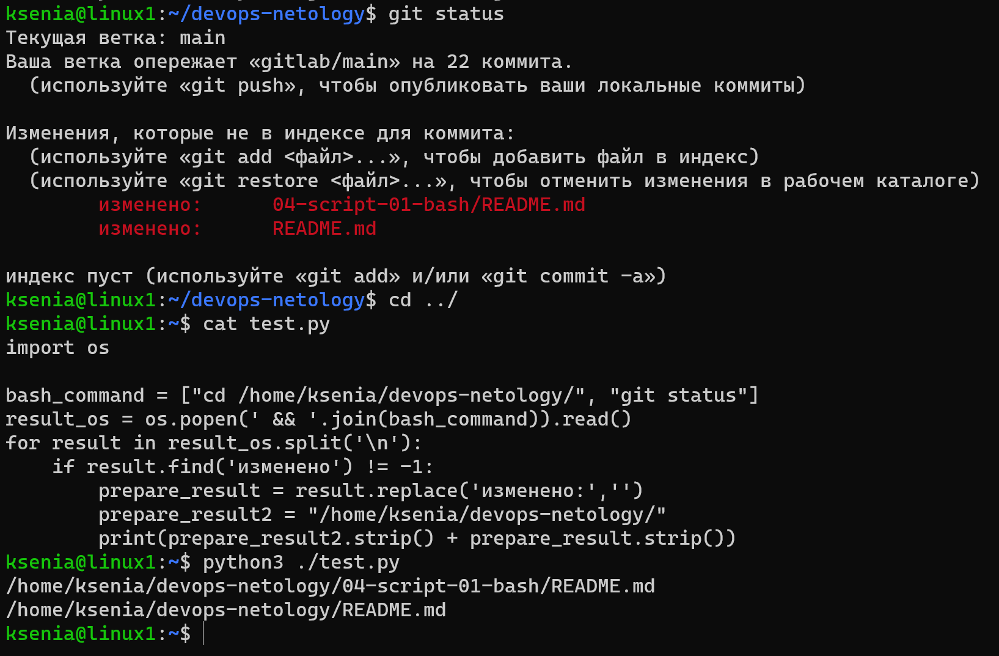
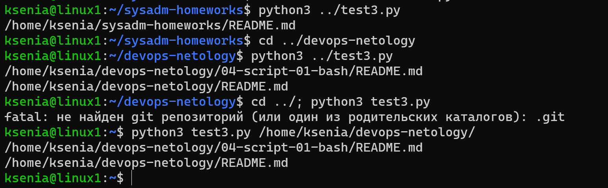
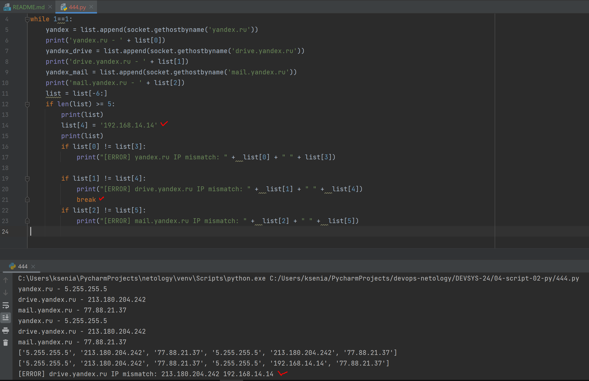

## Задание 1

Есть скрипт:
```python
#!/usr/bin/env python3
a = 1
b = '2'
c = a + b
```

### Вопросы:

| Вопрос  | Ответ                                                                                         |
| ------------- |-----------------------------------------------------------------------------------------------|
| Какое значение будет присвоено переменной `c`?  | Будет ошибка, т.к. два разных типа данных. Можно склеивать либо текст, либо складывать числа. |
| Как получить для переменной `c` значение 12?  | Нужно ввести a = '1' или при выводе поменять тип данных на str.                               |
| Как получить для переменной `c` значение 3?  | Нужно ввести b = 2 или при выводе поменять тип на int.                                        |

------

## Задание 2

Мы устроились на работу в компанию, где раньше уже был DevOps Engineer. Он написал скрипт, позволяющий узнать, какие файлы модифицированы в репозитории, относительно локальных изменений. Этим скриптом недовольно начальство, потому что в его выводе есть не все изменённые файлы, а также непонятен полный путь к директории, где они находятся. 

Как можно доработать скрипт ниже, чтобы он исполнял требования вашего руководителя?

```python
#!/usr/bin/env python3

import os

bash_command = ["cd ~/netology/sysadm-homeworks", "git status"]
result_os = os.popen(' && '.join(bash_command)).read()
is_change = False
for result in result_os.split('\n'):
    if result.find('modified') != -1:
        prepare_result = result.replace('\tmodified:   ', '')
        print(prepare_result)
        break
```

### Ваш скрипт:
```python
import os

bash_command = ["cd ~/netology/sysadm-homeworks", "git status"]
result_os = os.popen(' && '.join(bash_command)).read()
for result in result_os.split('\n'):
    if result.find('modified') != -1:
        prepare_result = result.replace('\tmodified:   ','')
        prepare_result2 = "~/netology/sysadm-homeworks"
        print(prepare_result2.strip() + prepare_result.strip())
```

### Вывод скрипта при запуске при тестировании:

У меня изменено слово на "изменено" и путь:




------

## Задание 3

Доработать скрипт выше так, чтобы он не только мог проверять локальный репозиторий в текущей директории, но и умел воспринимать путь к репозиторию, который мы передаём как входной параметр. Мы точно знаем, что начальство коварное и будет проверять работу этого скрипта в директориях, которые не являются локальными репозиториями.

### Ваш скрипт:
```python
import os
import sys

if len(sys.argv) == 1:
    directory = os.popen("pwd").read()
    result_os = os.popen("git status").read()
    for result in result_os.split('\n'):
        if result.find('modified') != -1:
            prepare_result = result.replace('\tmodified: ','')
            print(directory.strip() + "/" + prepare_result.strip())
else:
    directory = sys.argv[1]
    bash_command = [f"cd {directory}", "git status "]
    result_os = os.popen(' && '.join(bash_command)).read()
    for result in result_os.split('\n'):
        if result.find('modified') != -1:
            prepare_result = result.replace('\tmodified ','')
            print(directory.strip() + prepare_result.strip())
```

### Вывод скрипта при запуске при тестировании:

Работает из текущей директории, если аргумент не введен.
В конце вариант с аргументом:



------

## Задание 4

Наша команда разрабатывает несколько веб-сервисов, доступных по http. Мы точно знаем, что на их стенде нет никакой балансировки, кластеризации, за DNS прячется конкретный IP сервера, где установлен сервис. 

Проблема в том, что отдел, занимающийся нашей инфраструктурой очень часто меняет нам сервера, поэтому IP меняются примерно раз в неделю, при этом сервисы сохраняют за собой DNS имена. Это бы совсем никого не беспокоило, если бы несколько раз сервера не уезжали в такой сегмент сети нашей компании, который недоступен для разработчиков. 

Мы хотим написать скрипт, который: 
- опрашивает веб-сервисы, 
- получает их IP, 
- выводит информацию в стандартный вывод в виде: <URL сервиса> - <его IP>. 

Также, должна быть реализована возможность проверки текущего IP сервиса c его IP из предыдущей проверки. Если проверка будет провалена - оповестить об этом в стандартный вывод сообщением: [ERROR] <URL сервиса> IP mismatch: <старый IP> <Новый IP>. Будем считать, что наша разработка реализовала сервисы: `drive.google.com`, `mail.google.com`, `google.com`.

### Ваш скрипт:
Использовала вместо google.com yandex.com, т.к. у гугла выдается только 1 ip, преподаватель посоветовал нам использовать яндекс.
```python
import socket

list = []
while 1==1:
    yandex = list.append(socket.gethostbyname('yandex.ru'))
    print('yandex.ru - ' + list[0])
    yandex_drive = list.append(socket.gethostbyname('drive.yandex.ru'))
    print('drive.yandex.ru - ' + list[1])
    yandex_mail = list.append(socket.gethostbyname('mail.yandex.ru'))
    print('mail.yandex.ru - ' + list[2])
    list = list[-6:]
    if len(list) >= 5:
        if list[0] != list[3]:
            print("[ERROR] yandex.ru IP mismatch: " +  list[0] + " " + list[3])

        if list[1] != list[4]:
            print("[ERROR] drive.yandex.ru IP mismatch: " +  list[1] + " " +  list[4])
            
        if list[2] != list[5]:
            print("[ERROR] mail.yandex.ru IP mismatch: " +  list[2] + " " +  list[5])
```

### Вывод скрипта при запуске при тестировании:
Смену ip я так и не дождалась, подменила сама, для наглядности сделала вывод списка дважды и поставила break там, где должно было сработать условие, чтобы не пропустить вывод. Оно сработало верно.



