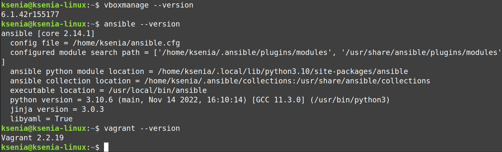
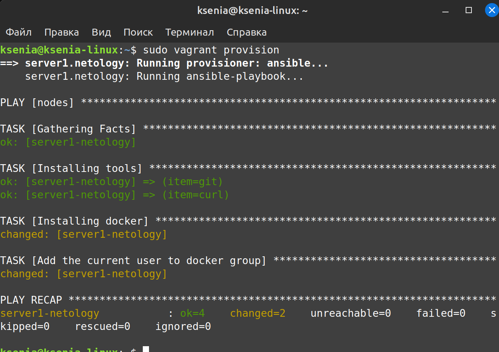
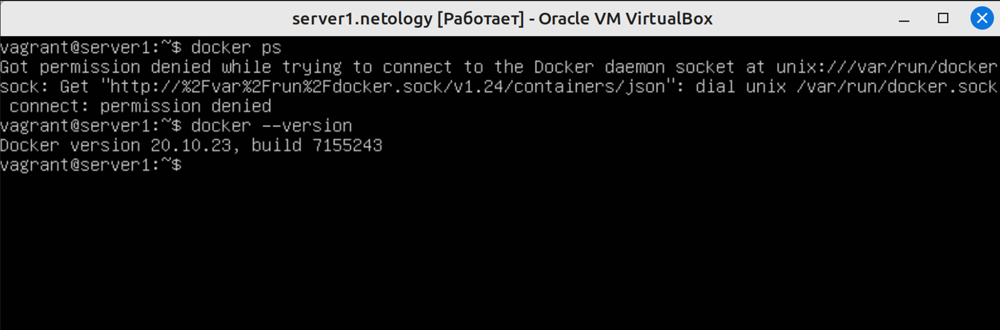

# Домашнее задание к занятию "2. Применение принципов IaaC в работе с виртуальными машинами"


## Задача 1

- Опишите своими словами основные преимущества применения на практике IaaC паттернов.

**Ответ:** 

`1. Ускорение производства и вывода продукта на рынок.`

`2. Стабильность среды, устранение дрейфа конфигураций`

`3. Более быстрая и эффективная разработка`

- Какой из принципов IaaC является основополагающим?

**Ответ:** 

`Идемпотентность — это свойство объекта или операции, при повторном выполнении которой мы получаем результат идентичный предыдущему и всем последующим выполнениям.`

## Задача 2

- Чем Ansible выгодно отличается от других систем управление конфигурациями?

**Ответ:** 

`Ansible написан на Python (интерпретатор которого есть в большинстве дистрибутивов linux), использует метод push, что не требует установки агентов, работа инструмента выполняется через SSH.`

- Какой, на ваш взгляд, метод работы систем конфигурации более надёжный push или pull?

**Ответ:** 

`Pull: подойдет для больших распределенных систем с необходимостью поддерживать конфигурацию в актуальном состоянии. Системы в которых конфигурируемые сервера могут не иметь постоянного доступа к серверу конфигураций.`

`Push: подойдет для автоматизации конфигурации сборки образов виртуальных машин. Провижининг новых серверов при запуске. Управление конфигурациями сетей.`

`Надежнее скорее pull, т.к. при методе push может быть ситуация, когда какой-либо из целевых хостов недоступен, он не получит свою конфигурацию.`

## Задача 3

Установить на личный компьютер:

- VirtualBox
- Vagrant
- Ansible




## Задача 4 (*)

Воспроизвести практическую часть лекции самостоятельно.

- Создать виртуальную машину.
- Зайти внутрь ВМ, убедиться, что Docker установлен с помощью команды
```
docker ps
```




