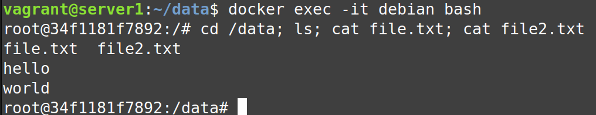

# Домашнее задание к занятию "3. Введение. Экосистема. Архитектура. Жизненный цикл Docker контейнера"


## Задача 1

Сценарий выполения задачи:

- создайте свой репозиторий на https://hub.docker.com;
- выберете любой образ, который содержит веб-сервер Nginx;
- создайте свой fork образа;
- реализуйте функциональность:
запуск веб-сервера в фоне с индекс-страницей, содержащей HTML-код ниже:
```
<html>
<head>
Hey, Netology
</head>
<body>
<h1>I’m DevOps Engineer!</h1>
</body>
</html>
```
Опубликуйте созданный форк в своем репозитории и предоставьте ответ в виде ссылки на https://hub.docker.com/username_repo.


**Процесс выполнения:**

Скачиваем образ: `docker pull nginx:alpine`

Создаем/редактируем index.html: `nano index.html`

Прописываем:
```
<html>
<head>
Hey, Netology
</head>
<body>
<h1>I'm DevOps Engineer!</h1>
</body>
</html>
```

Создаем/редактируем Dockerfile: `nano Dockerfile`

Прописываем:
```
FROM nginx:alpine
COPY ./index.html /usr/share/nginx/html/
```

Собираем образ: `docker build -t nginx:netology ./`

Запускаем контейнер для проверки: `docker run -d -p 80:80 nginx:netology`

Проверяем:

```
vagrant@server1:~$ curl http://192.168.56.11/
<html>
<head>
Hey, Netology
</head>
<body>
<h1>I'm DevOps Engineer!</h1>
</body>
</html>
```

Отправляем в репозиторий:

`docker login`

`docker tag nginx:netology ksenianikolaeva/devops-netology:nginx_netology`

`docker push ksenianikolaeva/devops-netology:nginx_netology`

`docker logout`

**Ссылка на репозиторий:**

https://hub.docker.com/repository/docker/ksenianikolaeva/devops-netology/general

## Задача 2

Посмотрите на сценарий ниже и ответьте на вопрос:
"Подходит ли в этом сценарии использование Docker контейнеров или лучше подойдет виртуальная машина, физическая машина? Может быть возможны разные варианты?"

Детально опишите и обоснуйте свой выбор.

--

Сценарий:

- Высоконагруженное монолитное java веб-приложение;

`Виртуальная машина т.к. приложение монолитное, будкт сложно разбить на микросервисы и высоконагруженное - 
необходим прямой доступ к ресурсам.`

- Nodejs веб-приложение;

`Докер, для более простого воспроизведения зависимостей.`

- Мобильное приложение c версиями для Android и iOS;

`Виртуальная машина, т.к. нужен графический интерфейс.`

- Шина данных на базе Apache Kafka;

`Докер, существуют образы для apache kafka, в плюс будет изолированность приложений, а также легкий откат на стабильные версии`

- Elasticsearch кластер для реализации логирования продуктивного веб-приложения - три ноды elasticsearch, два logstash и две ноды kibana;

`Elasticsearvh лучше в виртуальной машине, отказоустойчивость решается на уровне кластера, kibana и logstash можно в Docker.`

- Мониторинг-стек на базе Prometheus и Grafana;

`Docker. Есть готовые образы, удобно масштабировать и быстро разворачивать`

- MongoDB, как основное хранилище данных для java-приложения;

`Зависит от нагрузки на DB. Если нагрузка большая, то физический сервер, если нет – VM.`

- Gitlab сервер для реализации CI/CD процессов и приватный (закрытый) Docker Registry.

`Подойдет VM для DB и фалового хранилища, Docker для сервисов`

## Задача 3

- Запустите первый контейнер из образа ***centos*** c любым тэгом в фоновом режиме, подключив папку ```/data``` из текущей рабочей директории на хостовой машине в ```/data``` контейнера;
- Запустите второй контейнер из образа ***debian*** в фоновом режиме, подключив папку ```/data``` из текущей рабочей директории на хостовой машине в ```/data``` контейнера;
- Подключитесь к первому контейнеру с помощью ```docker exec``` и создайте текстовый файл любого содержания в ```/data```;
- Добавьте еще один файл в папку ```/data``` на хостовой машине;
- Подключитесь во второй контейнер и отобразите листинг и содержание файлов в ```/data``` контейнера.

**Ответ:**

Команды:

`mkdir data`

`docker run -it -d --name centos -v $(pwd)/data:/data centos:latest`

`docker run -it -d --name debian -v $(pwd)/data:/data debian:latest`

`docker exec -it centos bash`

`cd /data; echo "hello" > file.txt; exit`

`cd ./data; echo "world" > file2.txt`

`docker exec -it debian bash`

`cd /data; ls; cat file.txt; cat file2.txt; exit`

Скриншот:



## Задача 4 (*)

Воспроизвести практическую часть лекции самостоятельно.

Соберите Docker образ с Ansible, загрузите на Docker Hub и пришлите ссылку вместе с остальными ответами к задачам.

https://hub.docker.com/repository/docker/ksenianikolaeva/ansible/general