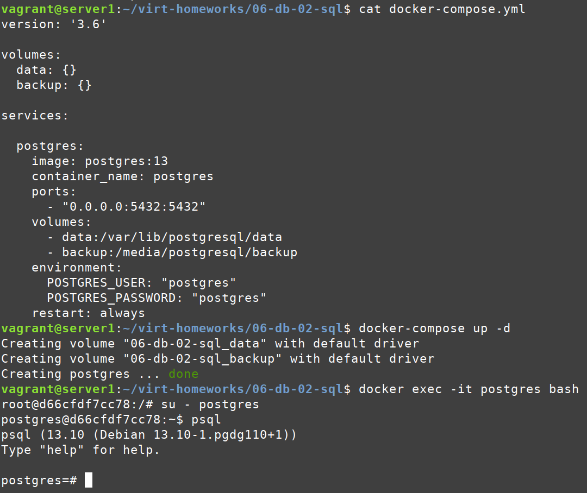

# Домашнее задание к занятию "2. SQL"

## Задача 1

Используя docker поднимите инстанс PostgreSQL (версию 12) c 2 volume, 
в который будут складываться данные БД и бэкапы.

Приведите получившуюся команду или docker-compose манифест.

**Ответ:**



## Задача 2

В БД из задачи 1: 
- создайте пользователя test-admin-user и БД test_db
- в БД test_db создайте таблицу orders и clients (спeцификация таблиц ниже)
- предоставьте привилегии на все операции пользователю test-admin-user на таблицы БД test_db
- создайте пользователя test-simple-user  
- предоставьте пользователю test-simple-user права на SELECT/INSERT/UPDATE/DELETE данных таблиц БД test_db

Таблица orders:
- id (serial primary key)
- наименование (string)
- цена (integer)

Таблица clients:
- id (serial primary key)
- фамилия (string)
- страна проживания (string, index)
- заказ (foreign key orders)

Приведите:
- итоговый список БД после выполнения пунктов выше,
- описание таблиц (describe)
- SQL-запрос для выдачи списка пользователей с правами над таблицами test_db
- список пользователей с правами над таблицами test_db

**Ответ:**

``` bash
vagrant@server1:~/virt-homeworks/06-db-02-sql$ docker exec -it postgres bash
root@d66cfdf7cc78:/# su - postgres
postgres@d66cfdf7cc78:~$ psql
psql (13.10 (Debian 13.10-1.pgdg110+1))
Type "help" for help.

postgres=# CREATE USER "test-admin-user" WITH PASSWORD 'netology';
CREATE ROLE
postgres=# CREATE DATABASE test_db;
CREATE DATABASE
postgres=# CREATE TABLE orders (
    id SERIAL,
    наименование VARCHAR, 
    цена INTEGER,
    PRIMARY KEY (id)
);
CREATE TABLE
postgres=# CREATE TABLE clients (
    id SERIAL,
    фамилия VARCHAR,
    "страна проживания" VARCHAR, 
    заказ INTEGER,
    PRIMARY KEY (id),
    CONSTRAINT fk_заказ
      FOREIGN KEY(заказ) 
            REFERENCES orders(id)
);
CREATE TABLE
postgres=# CREATE INDEX ON clients("страна проживания");
CREATE INDEX
postgres=# GRANT ALL ON TABLE orders, clients TO "test-admin-user";
GRANT
postgres=# CREATE USER "test-simple-user" WITH PASSWORD 'netology';
CREATE ROLE
postgres=# GRANT CONNECT ON DATABASE test_db TO "test-simple-user";
GRANT
postgres=# GRANT USAGE ON SCHEMA public TO "test-simple-user";
GRANT
postgres=# GRANT SELECT, INSERT, UPDATE, DELETE ON orders, clients TO "test-simple-user";
GRANT
postgres=# \l+
                                                                       List of databases
   Name    |  Owner   | Encoding |  Collate   |   Ctype    |       Access privileges       |  Size   | Tablespace |                Description                 
-----------+----------+----------+------------+------------+-------------------------------+---------+------------+--------------------------------------------
 postgres  | postgres | UTF8     | en_US.utf8 | en_US.utf8 |                               | 8061 kB | pg_default | default administrative connection database
 template0 | postgres | UTF8     | en_US.utf8 | en_US.utf8 | =c/postgres                  +| 7753 kB | pg_default | unmodifiable empty database
           |          |          |            |            | postgres=CTc/postgres         |         |            | 
 template1 | postgres | UTF8     | en_US.utf8 | en_US.utf8 | =c/postgres                  +| 7753 kB | pg_default | default template for new databases
           |          |          |            |            | postgres=CTc/postgres         |         |            | 
 test_db   | postgres | UTF8     | en_US.utf8 | en_US.utf8 | =Tc/postgres                 +| 7753 kB | pg_default | 
           |          |          |            |            | postgres=CTc/postgres        +|         |            | 
           |          |          |            |            | "test-simple-user"=c/postgres |         |            | 
(4 rows)

postgres=# \d+ clients
                                                                   Table "public.clients"
              Column               |       Type        | Collation | Nullable |               Default               | Storage  | Stats target | Description 
-----------------------------------+-------------------+-----------+----------+-------------------------------------+----------+--------------+-------------
 id                                | integer           |           | not null | nextval('clients_id_seq'::regclass) | plain    |              | 
 фамилия                           | character varying |           |          |                                     | extended |              | 
 страна проживания                 | character varying |           |          |                                     | extended |              | 
 заказ                             | integer           |           |          |                                     | plain    |              | 
Indexes:
    "clients_pkey" PRIMARY KEY, btree (id)
    "clients_страна проживания_idx" btree ("страна проживания")
Foreign-key constraints:
    "fk_заказ" FOREIGN KEY ("заказ") REFERENCES orders(id)
Access method: heap

postgres=# \d+ orders
                                                              Table "public.orders"
          Column          |       Type        | Collation | Nullable |              Default               | Storage  | Stats target | Description 
--------------------------+-------------------+-----------+----------+------------------------------------+----------+--------------+-------------
 id                       | integer           |           | not null | nextval('orders_id_seq'::regclass) | plain    |              | 
 наименование             | character varying |           |          |                                    | extended |              | 
 цена                     | integer           |           |          |                                    | plain    |              | 
Indexes:
    "orders_pkey" PRIMARY KEY, btree (id)
Referenced by:
    TABLE "clients" CONSTRAINT "fk_заказ" FOREIGN KEY ("заказ") REFERENCES orders(id)
Access method: heap

postgres=# SELECT 
    grantee, table_name, privilege_type 
FROM 
    information_schema.table_privileges 
WHERE 
    grantee in ('test-admin-user','test-simple-user')
    and table_name in ('clients','orders')
order by 
    1,2,3;
     grantee      | table_name | privilege_type 
------------------+------------+----------------
 test-admin-user  | clients    | DELETE
 test-admin-user  | clients    | INSERT
 test-admin-user  | clients    | REFERENCES
 test-admin-user  | clients    | SELECT
 test-admin-user  | clients    | TRIGGER
 test-admin-user  | clients    | TRUNCATE
 test-admin-user  | clients    | UPDATE
 test-admin-user  | orders     | DELETE
 test-admin-user  | orders     | INSERT
 test-admin-user  | orders     | REFERENCES
 test-admin-user  | orders     | SELECT
 test-admin-user  | orders     | TRIGGER
 test-admin-user  | orders     | TRUNCATE
 test-admin-user  | orders     | UPDATE
 test-simple-user | clients    | DELETE
 test-simple-user | clients    | INSERT
 test-simple-user | clients    | SELECT
 test-simple-user | clients    | UPDATE
 test-simple-user | orders     | DELETE
 test-simple-user | orders     | INSERT
 test-simple-user | orders     | SELECT
 test-simple-user | orders     | UPDATE
(22 rows)


```

## Задача 3

Используя SQL синтаксис - наполните таблицы следующими тестовыми данными:

Таблица orders

|Наименование|цена|
|------------|----|
|Шоколад| 10 |
|Принтер| 3000 |
|Книга| 500 |
|Монитор| 7000|
|Гитара| 4000|

Таблица clients

|ФИО|Страна проживания|
|------------|----|
|Иванов Иван Иванович| USA |
|Петров Петр Петрович| Canada |
|Иоганн Себастьян Бах| Japan |
|Ронни Джеймс Дио| Russia|
|Ritchie Blackmore| Russia|

Используя SQL синтаксис:
- вычислите количество записей для каждой таблицы 
- приведите в ответе:
    - запросы 
    - результаты их выполнения.

**Ответ:**

``` bash
postgres=# INSERT INTO orders VALUES (1, 'Шоколад', 10), (2, 'Принтер', 3000), (3, 'Книга', 500), (4, 'Монитор', 7000), (5, 'Гитара', 4000);
INSERT 0 5

test_db=# SELECT * FROM orders;
 id | наименование | цена
----+--------------+------
  1 | Шоколад      |   10
  2 | Принтер      | 3000
  3 | Книга        |  500
  4 | Монитор      | 7000
  5 | Гитара       | 4000
(5 rows)

postgres=# SELECT count(1) FROM orders;
 count
-------
     5
(1 row)

postgres=# INSERT INTO clients VALUES (1, 'Иванов Иван Иванович', 'USA'), (2, 'Петров Петр Петрович', 'Canada'), (3, 'Иоганн Себастьян Бах', 'Japan'), (4, 'Ронни Джеймс Дио', 'Russia'), (5, 'Ritchie Blackmore', 'Russia');
INSERT 0 5

postgres=# SELECT * FROM clients;
 id |       фамилия        | страна проживания | заказ
----+----------------------+-------------------+-------
  1 | Иванов Иван Иванович | USA               |
  2 | Петров Петр Петрович | Canada            |
  3 | Иоганн Себастьян Бах | Japan             |
  4 | Ронни Джеймс Дио     | Russia            |
  5 | Ritchie Blackmore    | Russia            |
(5 rows)

test_db=# SELECT count(1) FROM clients;
 count
-------
     5
(1 row)

```

## Задача 4

Часть пользователей из таблицы clients решили оформить заказы из таблицы orders.

Используя foreign keys свяжите записи из таблиц, согласно таблице:

|ФИО|Заказ|
|------------|----|
|Иванов Иван Иванович| Книга |
|Петров Петр Петрович| Монитор |
|Иоганн Себастьян Бах| Гитара |

Приведите SQL-запросы для выполнения данных операций.

Приведите SQL-запрос для выдачи всех пользователей, которые совершили заказ, а также вывод данного запроса.
 
Подсказк - используйте директиву `UPDATE`.

**Ответ:**

``` bash

postgres=# INSERT INTO orders VALUES (1, 'Шоколад', 10), (2, 'Принтер', 3000), (3, 'Книга', 500), (4, 'Монитор', 7000), (5, 'Гитара', 4000);
INSERT 0 5

postgres=# SELECT * FROM orders;
 id | наименование | цена
----+--------------+------
  1 | Шоколад      |   10
  2 | Принтер      | 3000
  3 | Книга        |  500
  4 | Монитор      | 7000
  5 | Гитара       | 4000
(5 rows)

postgres=# SELECT count(1) FROM orders;
 count
-------
     5
(1 row)

postgres=# INSERT INTO clients VALUES (1, 'Иванов Иван Иванович', 'USA'), (2, 'Петров Петр Петрович', 'Canada'), (3, 'Иоганн Себастьян Бах', 'Japan'), (4, 'Ронни Джеймс Дио', 'Russia'), (5, 'Ritchie Blackmore', 'Russia');
INSERT 0 5

postgres=# SELECT * FROM clients;
 id |       фамилия        | страна проживания | заказ
----+----------------------+-------------------+-------
  1 | Иванов Иван Иванович | USA               |
  2 | Петров Петр Петрович | Canada            |
  3 | Иоганн Себастьян Бах | Japan             |
  4 | Ронни Джеймс Дио     | Russia            |
  5 | Ritchie Blackmore    | Russia            |
(5 rows)

postgres=#  SELECT count(1) FROM clients;
 count
-------
     5
(1 row)

```
## Задача 5

Получите полную информацию по выполнению запроса выдачи всех пользователей из задачи 4 
(используя директиву EXPLAIN).

Приведите получившийся результат и объясните что значат полученные значения.

Ответ:

``` bash

postgres=# EXPLAIN SELECT c.* FROM clients c JOIN orders o ON c.заказ = o.id;
                               QUERY PLAN                               
------------------------------------------------------------------------
 Hash Join  (cost=37.00..57.24 rows=810 width=72)
   Hash Cond: (c."заказ" = o.id)
   ->  Seq Scan on clients c  (cost=0.00..18.10 rows=810 width=72)
   ->  Hash  (cost=22.00..22.00 rows=1200 width=4)
         ->  Seq Scan on orders o  (cost=0.00..22.00 rows=1200 width=4)
(5 rows)

postgres=# 


```
1. Построчно прочитана таблица orders
2. Создан кеш по полю id для таблицы orders
3. Прочитана таблица clients
4. Для каждой строки по полю "заказ" будет проверено, соответствует ли она чему-то в кеше orders
- если соответствия нет - строка будет пропущена
- если соответствие есть, то на основе этой строки и всех подходящих строках кеша СУБД сформирует вывод

## Задача 6

Создайте бэкап БД test_db и поместите его в volume, предназначенный для бэкапов (см. Задачу 1).

Остановите контейнер с PostgreSQL (но не удаляйте volumes).

Поднимите новый пустой контейнер с PostgreSQL.

Восстановите БД test_db в новом контейнере.

Приведите список операций, который вы применяли для бэкапа данных и восстановления. 

Ответ:

``` bash

root@5b37c3f8edab:/media/postgresql/backup# export PGPASSWORD=netology && pg_dumpall -h localhost -U postgres > /media/postgresql/backup/test_db.bak
root@5b37c3f8edab:/media/postgresql/backup# ls
test_db.bak
root@5b37c3f8edab:/media/postgresql/backup# exit
exit
vagrant@server1:~/virt-homeworks/06-db-02-sql$ docker-compose stop
Stopping postgres ... done
vagrant@server1:~/virt-homeworks/06-db-02-sql$ docker run --rm -d -e POSTGRES_USER=postgres -e POSTGRES_PASSWORD=netology -v 06-db-02-sql_backup:/media/postgresql/backup --name postgres11 postgres:13
53667280b32bafff6801f2ca677f1c93120a3268f0d48d907f780f1606d92a5e
vagrant@server1:~/virt-homeworks/06-db-02-sql$ docker exec -it postgres11  bash
root@53667280b32b:/# ls /media/postgresql/backup/
test_db.bak
root@53667280b32b:/# export PGPASSWORD=netology && psql -h localhost -U postgres -f /media/postgresql/backup/test_db.bak
SET
SET
SET
psql:/media/postgresql/backup/test_db.bak:14: ERROR:  role "postgres" already exists
ALTER ROLE
CREATE ROLE
ALTER ROLE
CREATE ROLE
ALTER ROLE
You are now connected to database "template1" as user "postgres".
SET
SET
SET
SET
SET
 set_config 
------------
 
(1 row)

SET
SET
SET
SET
You are now connected to database "postgres" as user "postgres".
SET
SET
SET
SET
SET
 set_config 
------------
 
(1 row)

SET
SET
SET
SET
SET
SET
CREATE TABLE
ALTER TABLE
CREATE SEQUENCE
ALTER TABLE
ALTER SEQUENCE
CREATE TABLE
ALTER TABLE
CREATE SEQUENCE
ALTER TABLE
ALTER SEQUENCE
ALTER TABLE
ALTER TABLE
COPY 5
COPY 5
 setval 
--------
      1
(1 row)

 setval 
--------
      1
(1 row)

ALTER TABLE
ALTER TABLE
CREATE INDEX
ALTER TABLE
GRANT
GRANT
GRANT
GRANT
GRANT
SET
SET
SET
SET
SET
 set_config 
------------
 
(1 row)

SET
SET
SET
SET
CREATE DATABASE
ALTER DATABASE
You are now connected to database "test_db" as user "postgres".
SET
SET
SET
SET
SET
 set_config 
------------
 
(1 row)

SET
SET
SET
SET
GRANT
root@53667280b32b:/# su - postgres
postgres@53667280b32b:~$ psql
psql (13.10 (Debian 13.10-1.pgdg110+1))
Type "help" for help.

postgres=# \l+
                                                                       List of databases
   Name    |  Owner   | Encoding |  Collate   |   Ctype    |       Access privileges       |  Size   | Tablespace |                Description                 
-----------+----------+----------+------------+------------+-------------------------------+---------+------------+--------------------------------------------
 postgres  | postgres | UTF8     | en_US.utf8 | en_US.utf8 |                               | 8101 kB | pg_default | default administrative connection database
 template0 | postgres | UTF8     | en_US.utf8 | en_US.utf8 | =c/postgres                  +| 7753 kB | pg_default | unmodifiable empty database
           |          |          |            |            | postgres=CTc/postgres         |         |            | 
 template1 | postgres | UTF8     | en_US.utf8 | en_US.utf8 | =c/postgres                  +| 7901 kB | pg_default | default template for new databases
           |          |          |            |            | postgres=CTc/postgres         |         |            | 
 test_db   | postgres | UTF8     | en_US.utf8 | en_US.utf8 | =Tc/postgres                 +| 7901 kB | pg_default | 
           |          |          |            |            | postgres=CTc/postgres        +|         |            | 
           |          |          |            |            | "test-simple-user"=c/postgres |         |            | 
(4 rows)

postgres=# \d+ clients
                                                                   Table "public.clients"
              Column               |       Type        | Collation | Nullable |               Default               | Storage  | Stats target | Description 
-----------------------------------+-------------------+-----------+----------+-------------------------------------+----------+--------------+-------------
 id                                | integer           |           | not null | nextval('clients_id_seq'::regclass) | plain    |              | 
 фамилия                           | character varying |           |          |                                     | extended |              | 
 страна проживания                 | character varying |           |          |                                     | extended |              | 
 заказ                             | integer           |           |          |                                     | plain    |              | 
Indexes:
    "clients_pkey" PRIMARY KEY, btree (id)
    "clients_страна проживания_idx" btree ("страна проживания")
Foreign-key constraints:
    "fk_заказ" FOREIGN KEY ("заказ") REFERENCES orders(id)
Access method: heap

postgres=# SELECT 
    grantee, table_name, privilege_type 
FROM 
    information_schema.table_privileges 
WHERE 
    grantee in ('test-admin-user','test-simple-user')
    and table_name in ('clients','orders')
order by 
    1,2,3;
     grantee      | table_name | privilege_type 
------------------+------------+----------------
 test-admin-user  | clients    | DELETE
 test-admin-user  | clients    | INSERT
 test-admin-user  | clients    | REFERENCES
 test-admin-user  | clients    | SELECT
 test-admin-user  | clients    | TRIGGER
 test-admin-user  | clients    | TRUNCATE
 test-admin-user  | clients    | UPDATE
 test-admin-user  | orders     | DELETE
 test-admin-user  | orders     | INSERT
 test-admin-user  | orders     | REFERENCES
 test-admin-user  | orders     | SELECT
 test-admin-user  | orders     | TRIGGER
 test-admin-user  | orders     | TRUNCATE
 test-admin-user  | orders     | UPDATE
 test-simple-user | clients    | DELETE
 test-simple-user | clients    | INSERT
 test-simple-user | clients    | SELECT
 test-simple-user | clients    | UPDATE
 test-simple-user | orders     | DELETE
 test-simple-user | orders     | INSERT
 test-simple-user | orders     | SELECT
 test-simple-user | orders     | UPDATE
(22 rows)

postgres=# 

```
