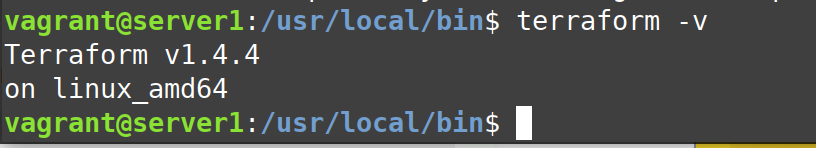
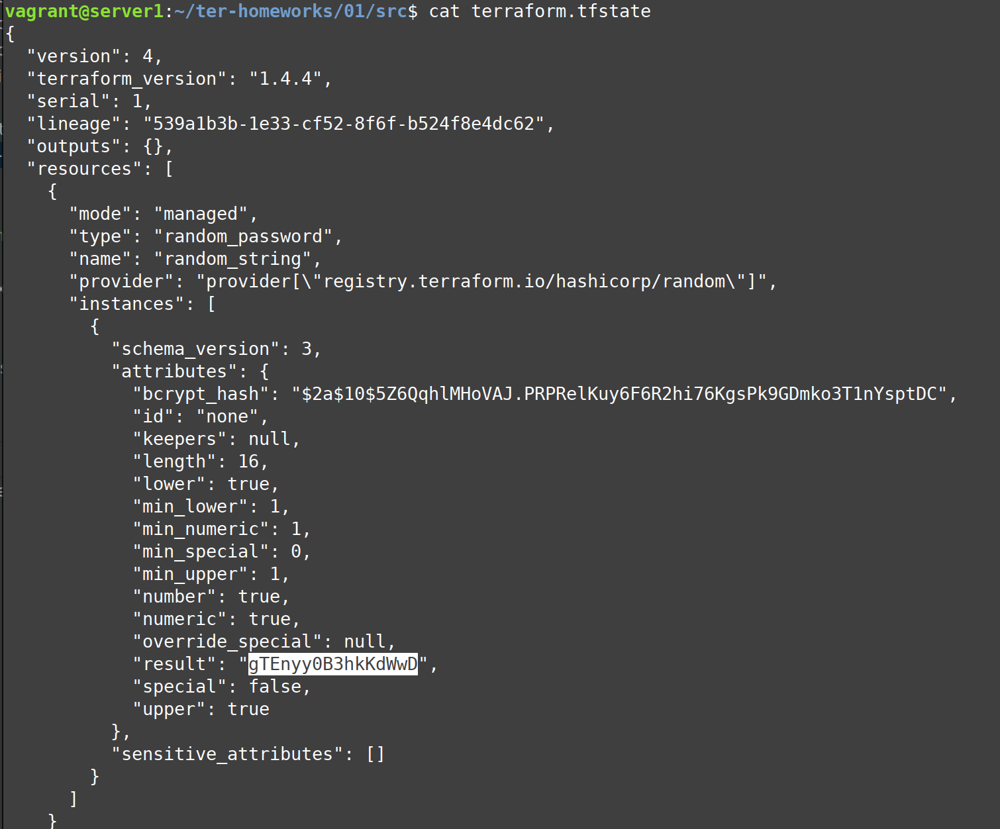

# Домашнее задание к занятию 1. «Инфраструктура как код»

## Задача 1. Выбор инструментов
 
### Легенда
 
Через час совещание, на котором менеджер расскажет о новом проекте. Начать работу над проектом нужно 
будет уже сегодня. 
Сейчас известно, что это будет сервис, который ваша компания будет предоставлять внешним заказчикам.
Первое время, скорее всего, будет один внешний клиент, со временем внешних клиентов станет больше.

Также по разговорам в компании есть вероятность, что техническое задание ещё не чёткое, что приведёт к большому
количеству небольших релизов, тестирований интеграций, откатов, доработок, то есть скучно не будет.  
   
Вам как DevOps-инженеру будет нужно принять решение об инструментах для организации инфраструктуры.
В вашей компании уже используются следующие инструменты: 

- остатки Сloud Formation, 
- некоторые образы сделаны при помощи Packer,
- год назад начали активно использовать Terraform, 
- разработчики привыкли использовать Docker, 
- уже есть большая база Kubernetes-конфигураций, 
- для автоматизации процессов используется Teamcity, 
- также есть совсем немного Ansible-скриптов, 
- ряд bash-скриптов для упрощения рутинных задач.  

На совещании нужно будет выяснить подробности о проекте, чтобы определиться с инструментами:

1. Какой тип инфраструктуры будем использовать для этого проекта: изменяемый или не изменяемый?
2. Будет ли центральный сервер для управления инфраструктурой?
3. Будут ли агенты на серверах?
4. Будут ли использованы средства для управления конфигурацией или инициализации ресурсов? 
 
Так как проект стартует уже сегодня, на совещании нужно будет определиться со всеми этими вопросами.

### Вам нужно:

1. Ответить на четыре вопроса из раздела «Легенда».
2. Решить, какие инструменты из уже используемых вы хотели бы применить для нового проекта.
3. Определиться, хотите ли рассмотреть возможность внедрения новых инструментов для этого проекта.

Если для ответов на эти вопросы недостаточно информации, напишите, какие моменты уточните на совещании.

**- Какой тип инфраструктуры будем использовать для этого проекта: изменяемый или не изменяемый?**

Неизменяемый. В ТЗ написано о частых релизах, а команда привыкла использовать Docker. Будет удобно готовить сервера связкой Пакер-Терраформ.

**- Будет ли центральный сервер для управления инфраструктурой?**

И да и нет. Инструменты, которые будем использовать для оркестрации, не требуют сервера (Packer, Terraform, Ansible), но конфигурации будут храниться в git.

**- Будут ли агенты на серверах?**

Нет. Будем использовать ssh.

**- Будут ли использованы средства для управления конфигурацией или инициализации ресурсов?** 

Да, они уже используются: Terraform. Предлагаю оставить.

**- Какие инструменты из уже используемых вы хотели бы использовать для нового проекта?** 

Packer, Terraform, Docker, Kubernetes, Ansible.

**- Хотите ли рассмотреть возможность внедрения новых инструментов для этого проекта?**

Возможно от TeamCity лучше отказаться в пользу GitLab CI/CD. У последнего больше сообщество и больше информации по интеграции с Kubernetes, к которому сейчас привыкли (много конфигураций), а с ростом проекта он может вытеснить Docker.

## Задача 2. Установка Terraform

[Официальный сайт Terraform](https://www.terraform.io/).   
В связи с недоступностью ресурсов для загрузки Terraform на территории РФ вы можете воспользоваться VPN или использовать зеркало YandexCloud:      
[ссылки для установки открытого ПО](https://github.com/netology-code/devops-materials/blob/master/README.md)

Установите Terraform при помощи менеджера пакетов, используемого в вашей операционной системе.
В виде результата этой задачи приложите вывод команды `terraform --version`.

## Задача 3. Поддержка legacy-кода

В какой-то момент вы обновили Terraform до новой версии, например с 0.12 до 0.13. 
Код одного из проектов настолько устарел, что не может работать с версией 0.13. 
Нужно сделать так, чтобы вы могли одновременно использовать последнюю версию Terraform, установленную при помощи
штатного менеджера пакетов, и устаревшую версию 0.12. 

В виде результата этой задачи приложите вывод `--version` двух версий Terraform, доступных на вашем компьютере 
или виртуальной машине.

