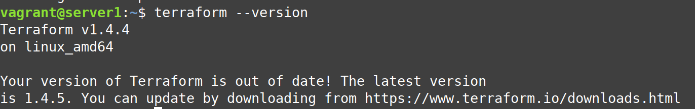
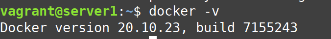

# Домашнее задание к занятию "Введение в Terraform"

### Цель задания

1. Установить и настроить Terrafrom.
2. Научиться использовать готовый код.

------

### Чеклист готовности к домашнему заданию

1. Скачайте и установите актуальную версию **terraform**(не менее 1.3.7). Приложите скриншот вывода команды ```terraform --version```



2. Скачайте на свой ПК данный git репозиторий. Исходный код для выполнения задания расположен в директории **01/src**.
3. Убедитесь, что в вашей ОС установлен docker



------

### Инструменты и дополнительные материалы, которые пригодятся для выполнения задания

1. Установка и настройка Terraform  [ссылка](https://cloud.yandex.ru/docs/tutorials/infrastructure-management/terraform-quickstart#from-yc-mirror)
2. Зеркало документации Terraform  [ссылка](https://registry.tfpla.net/browse/providers) 
3. Установка docker [ссылка](https://docs.docker.com/engine/install/ubuntu/) 
------

### Задание 1

1. Перейдите в каталог [**src**](https://github.com/netology-code/ter-homeworks/tree/main/01/src). Скачайте все необходимые зависимости, использованные в проекте. 
2. Изучите файл **.gitignore**. В каком terraform файле допустимо сохранить личную, секретную информацию?

**Ответ:** В тех, что перечислены в файле .gitignore, а именно с расширением `.terraform*` `*.tfstate` `*.tfstate.*`. Они не попадут в удаленный репозиторий, эти файлы для локального хранения. 

_**Доработка:** personal.auto.tfvars

3. Выполните код проекта. Найдите  в State-файле секретное содержимое созданного ресурса **random_password**. Пришлите его в качестве ответа.

**Ответ:** 


4. Раскомментируйте блок кода, примерно расположенный на строчках 29-42 файла **main.tf**.
Выполните команду ```terraform validate```. Объясните в чем заключаются намеренно допущенные ошибки? Исправьте их.

**Ответ:** Произошло две ошибки. Не указано имя для ресурса, должно быть так `resource "type" "name" {..}`, вторая ошибка "недопустимое имя ресурса", имя должно начинаться с буквы или подчеркивания, может содержать буквы, двоеточие и тире. Исправила, заработало:


5. Выполните код. В качестве ответа приложите вывод команды ```docker ps```


6. Замените имя docker-контейнера в блоке кода на ```hello_world```, выполните команду ```terraform apply -auto-approve```.
Объясните своими словами, в чем может быть опасность применения ключа  ```-auto-approve``` ? 

**Ответ:** Ну насколько я поняла, при использовании `-auto-approve` терраформ не спрашивает, выполнять код или нет, таким образом мы можем развернуть что-то не то по ошибке. Также, я заметила, он удалил и предыдущий контейнер, так что есть вероятность и удаления нужных ресурсов. Но наверное этот параметр очень хорош при автоматизации.


8. Уничтожьте созданные ресурсы с помощью **terraform**. Убедитесь, что все ресурсы удалены. Приложите содержимое файла **terraform.tfstate**.

Ответ: Команда `terraform destroy`


9. Объясните, почему при этом не был удален docker образ **nginx:latest** ?(Ответ найдите в коде проекта или документации)

**Ответ:** в main.tf стоит параметр `keep_locally = true`, если параметр убрать, образ будет удаляться.


