# Домашнее задание к занятию "Основы Terraform. Yandex Cloud"

### Цель задания

1. Создать свои ресурсы в облаке Yandex Cloud с помощью Terraform.
2. Освоить работу с переменными Terraform.


### Чеклист готовности к домашнему заданию

1. Зарегистрирован аккаунт в Yandex Cloud. Использован промокод на грант.
2. Установлен инструмент Yandex Cli.
3. Исходный код для выполнения задания расположен в директории [**02/src**](https://github.com/netology-code/ter-homeworks/tree/main/02/src).


### Задание 0

1. Ознакомьтесь с [документацией к security-groups в Yandex Cloud](https://cloud.yandex.ru/docs/vpc/concepts/security-groups?from=int-console-help-center-or-nav).
2. Запросите preview доступ к данному функционалу в ЛК Yandex Cloud. Обычно его выдают в течении 24-х часов.
https://console.cloud.yandex.ru/folders/<ваш cloud_id>/vpc/security-groups
Этот функционал понадобится к следующей лекции. 


### Задание 1

1. Изучите проект. В файле variables.tf объявлены переменные для yandex provider.
2. Переименуйте файл personal.auto.tfvars_example в personal.auto.tfvars. Заполните переменные (идентификаторы облака, токен доступа). Благодаря .gitignore этот файл не попадет в публичный репозиторий. **Вы можете выбрать иной способ безопасно передать секретные данные в terraform.**
3. Сгенерируйте или используйте свой текущий ssh ключ. Запишите его открытую часть в переменную **vms_ssh_root_key**.
4. Инициализируйте проект, выполните код. Исправьте возникшую ошибку. Ответьте в чем заключается ее суть?
5. Ответьте, как в процессе обучения могут пригодиться параметры```preemptible = true``` и ```core_fraction=5``` в параметрах ВМ? Ответ в документации Yandex cloud.

В качестве решения приложите:
- скриншот ЛК Yandex Cloud с созданной ВМ,
- скриншот успешного подключения к консоли ВМ через ssh,
- ответы на вопросы.


**Ответ:**

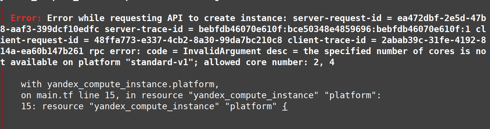


Ошибка указывает на недопустимое количество ядер для платформы <code>standard-v1</code>.
Разрешенное количество ядер 2, 4.

<code>preemptible = true</code> - делает ВМ прерываемой.

<code>core_fraction = 5</code> - задает уровень производительности процессора ВМ.

<blockquote>Прерываемые виртуальные машины доступны по более низкой цене в сравнении с обычными, однако не обеспечивают отказоустойчивости.
</blockquote>
<blockquote>
ВМ с уровнем производительности меньше 100% предназначены для запуска приложений, не требующих высокой производительности и не чувствительных к задержкам. Такие машины обойдутся дешевле.
</blockquote>


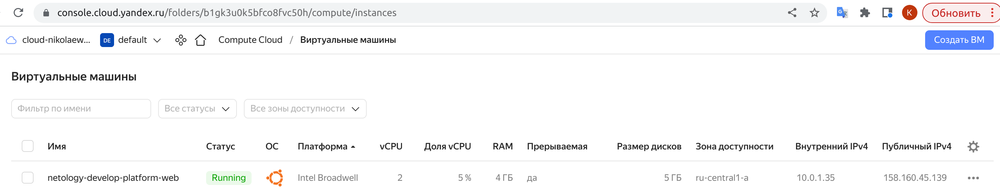

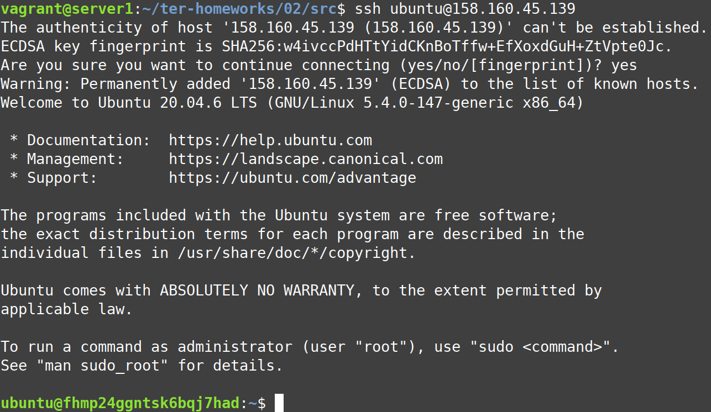


### Задание 2

1. Изучите файлы проекта.
2. Замените все "хардкод" **значения** для ресурсов **yandex_compute_image** и **yandex_compute_instance** на **отдельные** переменные. К названиям переменных ВМ добавьте в начало префикс **vm_web_** .  Пример: **vm_web_name**.
2. Объявите нужные переменные в файле variables.tf, обязательно указывайте тип переменной. Заполните их **default** прежними значениями из main.tf. 
3. Проверьте terraform plan (изменений быть не должно).

**Ответ:**

Код в main.tf:

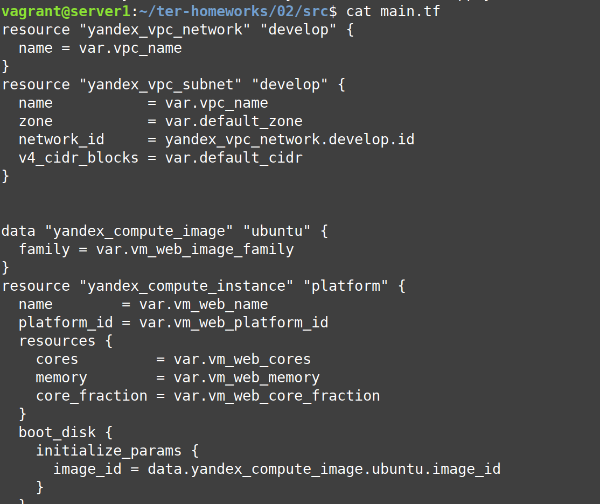

Переменные в variables.tf:

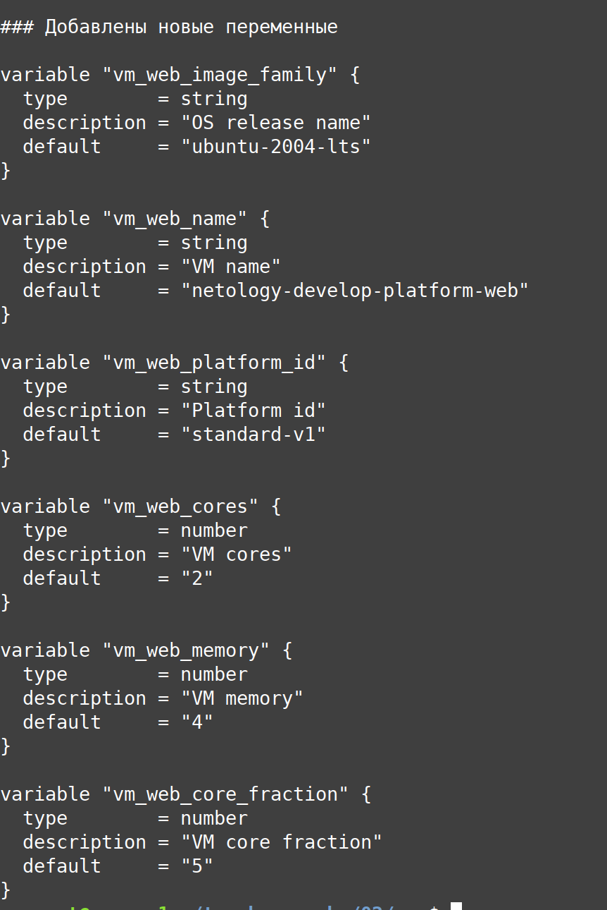

Проверка `terraform plan` прошла удачно, изменений нет:

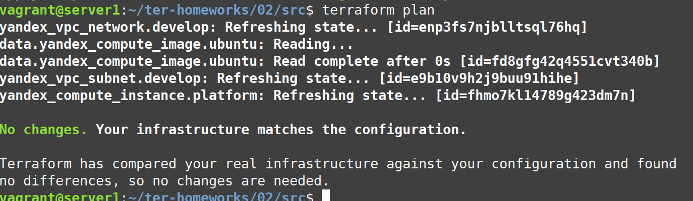


### Задание 3

1. Создайте в корне проекта файл 'vms_platform.tf' . Перенесите в него все переменные ВМ.
2. Скопируйте блок ресурса и создайте с его помощью вторую ВМ: **"netology-develop-platform-db"** ,  cores  = 2, memory = 2, core_fraction = 20. Объявите ее переменные с префиксом **vm_db_** в том же файле.
3. Примените изменения.

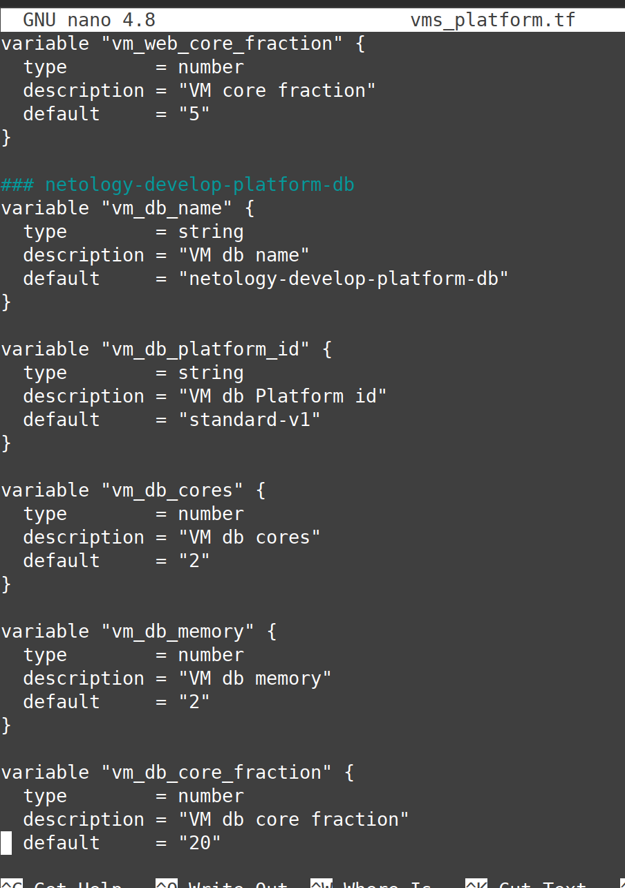

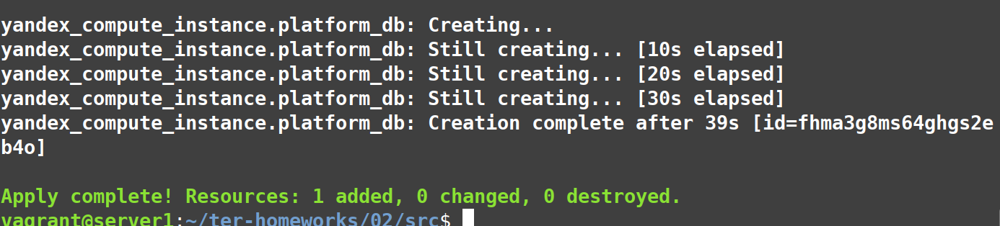

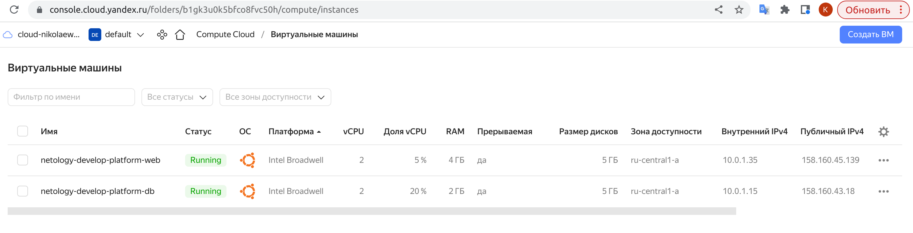

### Задание 4

1. Объявите в файле outputs.tf отдельные output, для каждой из ВМ с ее внешним IP адресом.
2. Примените изменения.

В качестве решения приложите вывод значений ip-адресов команды ```terraform output```

Ответ:

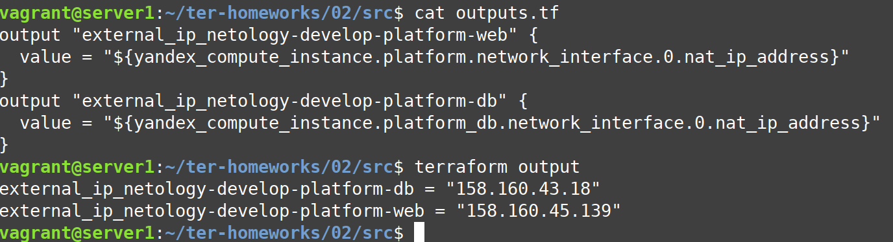


### Задание 5

1. В файле locals.tf опишите в **одном** local-блоке имя каждой ВМ, используйте интерполяцию ${..} с несколькими переменными по примеру из лекции.

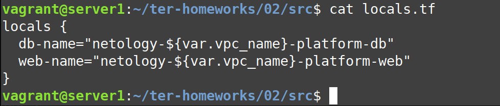

2. Замените переменные с именами ВМ из файла variables.tf на созданные вами local переменные.

``` bash
resource "yandex_compute_instance" "platform" {
  name = local.web-name
  ...
}
resource "yandex_compute_instance" "platform-db" {
  name = local.db-name
  ...
}
```

3. Примените изменения.

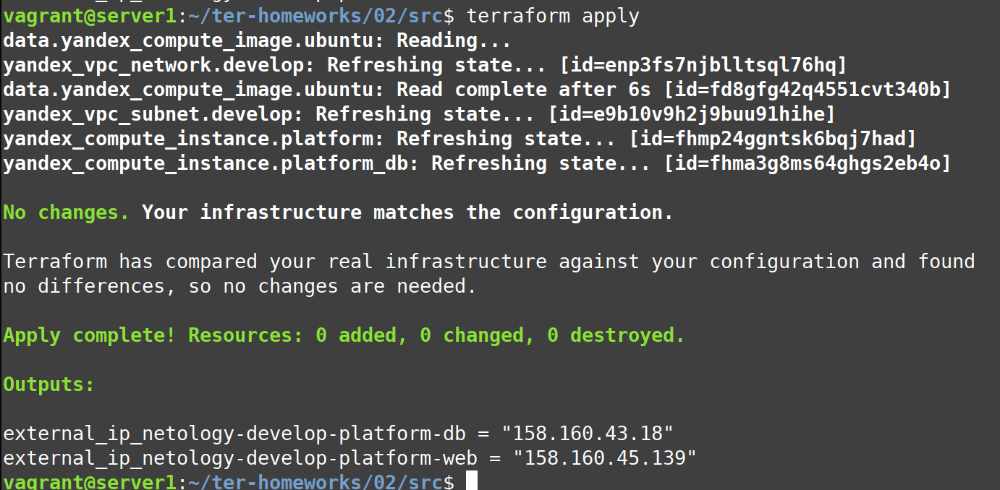

### Задание 6

1. Вместо использования 3-х переменных  ".._cores",".._memory",".._core_fraction" в блоке  resources {...}, объедените их в переменные типа **map** с именами "vm_web_resources" и "vm_db_resources".

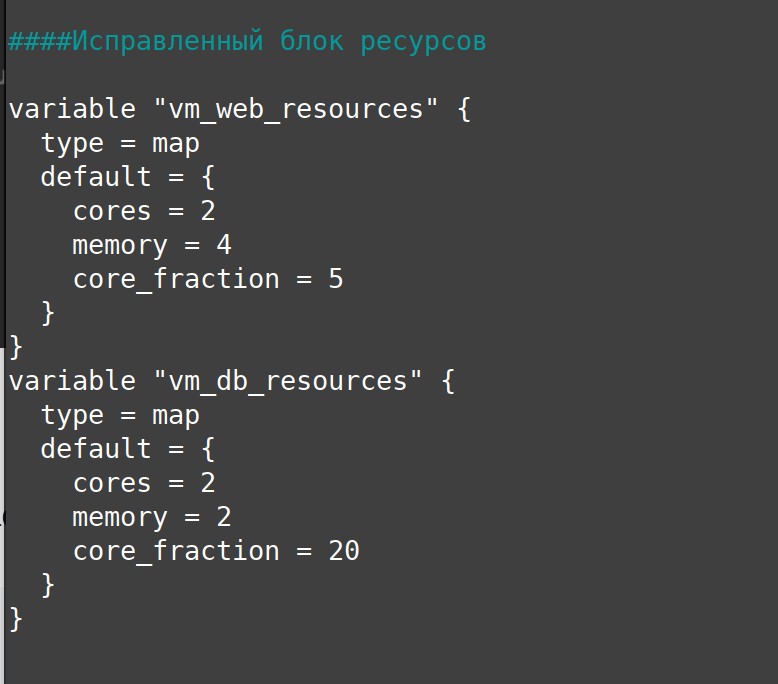

2. Так же поступите с блоком **metadata {serial-port-enable, ssh-keys}**, эта переменная должна быть общая для всех ваших ВМ.

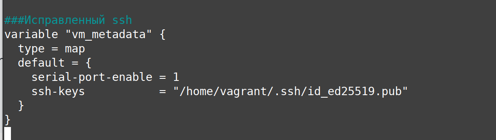

3. Найдите и удалите все более не используемые переменные проекта.
4. Проверьте terraform plan (изменений быть не должно).


main.tf:
``` bash
resource "yandex_vpc_network" "develop" {
  name = var.vpc_name
}
resource "yandex_vpc_subnet" "develop" {
  name           = var.vpc_name
  zone           = var.default_zone
  network_id     = yandex_vpc_network.develop.id
  v4_cidr_blocks = var.default_cidr
}


data "yandex_compute_image" "ubuntu" {
  family = var.vm_web_image_family
}
resource "yandex_compute_instance" "platform" {
  name        = local.web-name
  platform_id = var.vm_web_platform_id
  resources {
    cores         = var.vm_web_resources.cores
    memory        = var.vm_web_resources.memory
    core_fraction = var.vm_web_resources.core_fraction
  }
  boot_disk {
    initialize_params {
      image_id = data.yandex_compute_image.ubuntu.image_id
    }
  }
  scheduling_policy {
    preemptible = true
  }
  network_interface {
    subnet_id = yandex_vpc_subnet.develop.id
    nat       = true
  }
  metadata = {
    serial-port-enable = var.vm_metadata.serial-port-enable
   ssh-keys           = "ubuntu:${file(var.vm_metadata.ssh-keys)}"
  }

}


resource "yandex_compute_instance" "platform_db" {
  name        = local.db-name
  platform_id = var.vm_db_platform_id
  resources {
    cores         = var.vm_db_resources.cores
    memory        = var.vm_db_resources.memory
    core_fraction = var.vm_db_resources.core_fraction
  }
  boot_disk {
    initialize_params {
      image_id = data.yandex_compute_image.ubuntu.image_id
    }
  }
  scheduling_policy {
    preemptible = true
  }
  network_interface {
    subnet_id = yandex_vpc_subnet.develop.id
    nat       = true
  }
  metadata = {
    serial-port-enable = var.vm_metadata.serial-port-enable
    ssh-keys = "ubuntu:${file(var.vm_metadata.ssh-keys)}"
  }

}

```

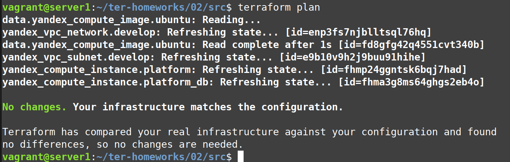