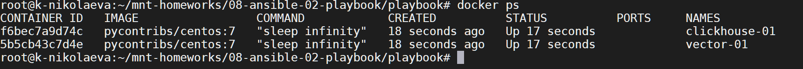

# Домашнее задание к занятию 2 «Работа с Playbook»

## Подготовка к выполнению

1. * Необязательно. Изучите, что такое [ClickHouse](https://www.youtube.com/watch?v=fjTNS2zkeBs) и [Vector](https://www.youtube.com/watch?v=CgEhyffisLY).
2. Создайте свой публичный репозиторий на GitHub с произвольным именем или используйте старый.
3. Скачайте [Playbook](./playbook/) из репозитория с домашним заданием и перенесите его в свой репозиторий.
4. Подготовьте хосты в соответствии с группами из предподготовленного playbook.

```
version : "2.4"
services:
 centos7-clickhouse:
    image: pycontribs/centos:7
    container_name: clickhouse-01
    restart: unless-stopped
    entrypoint: "sleep infinity"
 centos7-vector:
    image: pycontribs/centos:7
    container_name: vector-01
    restart: unless-stopped
    entrypoint: "sleep infinity"
```




## Основная часть

1. Подготовьте свой inventory-файл `prod.yml`.
```
---
clickhouse:
  hosts:
    clickhouse-01:
      ansible_connection: docker
vector:
  hosts:
    vector-01:
      ansible_connection: docker
```
2. Допишите playbook: нужно сделать ещё один play, который устанавливает и настраивает [vector](https://vector.dev). Конфигурация vector должна деплоиться через template файл jinja2. От вас не требуется использовать все возможности шаблонизатора, просто вставьте стандартный конфиг в template файл. Информация по шаблонам по [ссылке](https://www.dmosk.ru/instruktions.php?object=ansible-nginx-install). не забудьте сделать handler на перезапуск vector в случае изменения конфигурации!
```
---
- name: Install Clickhouse
  hosts: clickhouse-01
  handlers:
    - name: Start clickhouse service
      become: true
      ansible.builtin.service:
        name: clickhouse-server
        state: restarted
  tasks:
    - block:
        - name: Get clickhouse distrib
          ansible.builtin.get_url:
            url: "https://packages.clickhouse.com/rpm/stable/{{ item }}-{{ clickhouse_version }}.x86_64.rpm"
            dest: "./{{ item }}-{{ clickhouse_version }}.rpm"
          with_items: "{{ clickhouse_packages }}"
      rescue:
        - name: Get clickhouse distrib
          ansible.builtin.get_url:
            url: "https://packages.clickhouse.com/rpm/stable/clickhouse-common-static-{{ clickhouse_version }}.x86_64.rpm"
            dest: "./clickhouse-common-static-{{ clickhouse_version }}.rpm"
    - name: Install clickhouse packages
      become: true
      ansible.builtin.yum:
        name:
          - ./clickhouse-common-static-{{ clickhouse_version }}.rpm
          - ./clickhouse-client-{{ clickhouse_version }}.rpm
          - ./clickhouse-server-{{ clickhouse_version }}.rpm
        disable_gpg_check: true
      notify: Start clickhouse service
    - name: Flush handlers
      meta: flush_handlers
    - name: Create database
      ansible.builtin.command: "clickhouse-client -q 'create database logs;'"
      register: create_db
      failed_when: create_db.rc != 0 and create_db.rc !=82
      changed_when: create_db.rc == 0

- name: Install Vector
  hosts: vector-01
  handlers:
    - name: Start Vector service
      become: true
      ansible.builtin.service:
        name: vector
        state: started
  tasks:
    - name: Download vector packages
      ansible.builtin.get_url:
        url: "https://packages.timber.io/vector/{{ vector_version }}/vector-{{ vector_version }}-1.x86_64.rpm"
        dest: "./vector-{{ vector_version }}-1.x86_64.rpm"
        validate_certs: no
    - name: Install vector packages
      become: true
      ansible.builtin.yum:
        name: "./vector-{{ vector_version }}-1.x86_64.rpm"
        disable_gpg_check: true
        validate_certs: no
    - name: Apply vector template
      become: true
      ansible.builtin.template:
        src: vector.yml.j2
        dest: "{{ vector_config_dir }}/vector.yml"
        mode: "0644"
        owner: "{{ ansible_user_id }}"
        group: "{{ ansible_user_gid }}"
        validate: vector validate --no-environment --config-yaml %s
    - name: Change vector systemd unit
      become: true
      ansible.builtin.template:
        src: vector.service.j2
        dest: /usr/lib/systemd/system/vector.service
        mode: "0644"
        owner: "{{ ansible_user_id }}"
        group: "{{ ansible_user_gid }}"
        backup: true
      notify: Start vector service

```
3. При создании tasks рекомендую использовать модули: `get_url`, `template`, `unarchive`, `file`.
4. Tasks должны: скачать дистрибутив нужной версии, выполнить распаковку в выбранную директорию, установить vector.
5. Запустите `ansible-lint site.yml` и исправьте ошибки, если они есть.
6. Попробуйте запустить playbook на этом окружении с флагом `--check`.
```
root@k-nikolaeva:~/mnt-homeworks/08-ansible-02-playbook/playbook# ansible-playbook -i ./inventory/prod.yml site.yml --check

PLAY [Install Clickhouse] ************************************************************************************************

TASK [Gathering Facts] ***************************************************************************************************
ok: [clickhouse-01]

TASK [Get clickhouse distrib] ********************************************************************************************
ok: [clickhouse-01] => (item=clickhouse-client)
ok: [clickhouse-01] => (item=clickhouse-server)
ok: [clickhouse-01] => (item=clickhouse-common-static)

TASK [Install clickhouse packages] ***************************************************************************************
ok: [clickhouse-01]

TASK [Flush handlers] ****************************************************************************************************

TASK [Create database] ***************************************************************************************************
skipping: [clickhouse-01]

PLAY [Install Vector] ****************************************************************************************************

TASK [Gathering Facts] ***************************************************************************************************
ok: [vector-01]

TASK [Download vector packages] ******************************************************************************************
ok: [vector-01]

TASK [Install vector packages] *******************************************************************************************
ok: [vector-01]

TASK [Apply vector template] *********************************************************************************************
ok: [vector-01]

TASK [Change vector systemd unit] ****************************************************************************************
ok: [vector-01]

PLAY RECAP ***************************************************************************************************************
clickhouse-01              : ok=3    changed=0    unreachable=0    failed=0    skipped=1    rescued=0    ignored=0
vector-01                  : ok=5    changed=0    unreachable=0    failed=0    skipped=0    rescued=0    ignored=0

```
7. Запустите playbook на `prod.yml` окружении с флагом `--diff`. Убедитесь, что изменения на системе произведены.
```

root@k-nikolaeva:~/mnt-homeworks/08-ansible-02-playbook/playbook# ansible-playbook -i ./inventory/prod.yml site.yml --diff

PLAY [Install Clickhouse] ************************************************************************************************

TASK [Gathering Facts] ***************************************************************************************************
ok: [clickhouse-01]

TASK [Get clickhouse distrib] ********************************************************************************************
ok: [clickhouse-01] => (item=clickhouse-client)
ok: [clickhouse-01] => (item=clickhouse-server)
ok: [clickhouse-01] => (item=clickhouse-common-static)

TASK [Install clickhouse packages] ***************************************************************************************
ok: [clickhouse-01]

TASK [Flush handlers] ****************************************************************************************************

TASK [Create database] ***************************************************************************************************
ok: [clickhouse-01]

PLAY [Install Vector] ****************************************************************************************************

TASK [Gathering Facts] ***************************************************************************************************
ok: [vector-01]

TASK [Download vector packages] ******************************************************************************************
ok: [vector-01]

TASK [Install vector packages] *******************************************************************************************
ok: [vector-01]

TASK [Apply vector template] *********************************************************************************************
ok: [vector-01]

TASK [Change vector systemd unit] ****************************************************************************************
ok: [vector-01]

PLAY RECAP ***************************************************************************************************************
clickhouse-01              : ok=4    changed=0    unreachable=0    failed=0    skipped=0    rescued=0    ignored=0
vector-01                  : ok=5    changed=0    unreachable=0    failed=0    skipped=0    rescued=0    ignored=0


```
8. Повторно запустите playbook с флагом `--diff` и убедитесь, что playbook идемпотентен.
```

root@k-nikolaeva:~/mnt-homeworks/08-ansible-02-playbook/playbook# ansible-playbook -i ./inventory/prod.yml site.yml --diff

PLAY [Install Clickhouse] ************************************************************************************************

TASK [Gathering Facts] ***************************************************************************************************
ok: [clickhouse-01]

TASK [Get clickhouse distrib] ********************************************************************************************
ok: [clickhouse-01] => (item=clickhouse-client)
ok: [clickhouse-01] => (item=clickhouse-server)
ok: [clickhouse-01] => (item=clickhouse-common-static)

TASK [Install clickhouse packages] ***************************************************************************************
ok: [clickhouse-01]

TASK [Flush handlers] ****************************************************************************************************

TASK [Create database] ***************************************************************************************************
ok: [clickhouse-01]

PLAY [Install Vector] ****************************************************************************************************

TASK [Gathering Facts] ***************************************************************************************************
ok: [vector-01]

TASK [Download vector packages] ******************************************************************************************
ok: [vector-01]

TASK [Install vector packages] *******************************************************************************************
ok: [vector-01]

TASK [Apply vector template] *********************************************************************************************
ok: [vector-01]

TASK [Change vector systemd unit] ****************************************************************************************
ok: [vector-01]

PLAY RECAP ***************************************************************************************************************
clickhouse-01              : ok=4    changed=0    unreachable=0    failed=0    skipped=0    rescued=0    ignored=0
vector-01                  : ok=5    changed=0    unreachable=0    failed=0    skipped=0    rescued=0    ignored=0

```
9. Подготовьте README.md-файл по своему playbook. В нём должно быть описано: что делает playbook, какие у него есть параметры и теги. Пример качественной документации ansible playbook по [ссылке](https://github.com/opensearch-project/ansible-playbook). Так же приложите скриншоты выполнения заданий №5-8
- [README.md](playbook/README.md)
10. Готовый playbook выложите в свой репозиторий, поставьте тег `08-ansible-02-playbook` на фиксирующий коммит, в ответ предоставьте ссылку на него.

---

### Как оформить решение задания

Выполненное домашнее задание пришлите в виде ссылки на .md-файл в вашем репозитории.

---