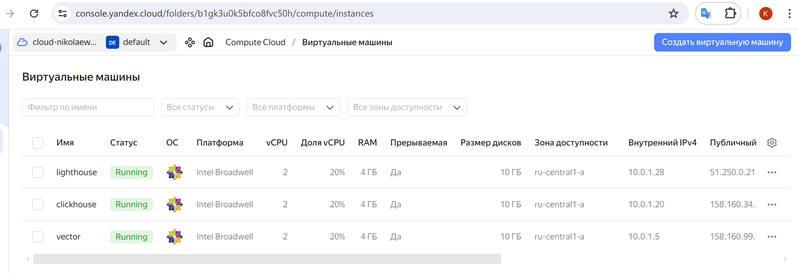

# Домашнее задание к занятию 3 «Использование Ansible»

## Подготовка к выполнению

1. Подготовьте в Yandex Cloud три хоста: для `clickhouse`, для `vector` и для `lighthouse`.



2. Репозиторий LightHouse находится [по ссылке](https://github.com/VKCOM/lighthouse).

## Основная часть

1. Допишите playbook: нужно сделать ещё один play, который устанавливает и настраивает LightHouse.

Файлы:
- [tamplate](playbook/templates) 
- [site.yml](playbook/site.yml)

```shell
- name: Install lighthouse
  hosts: lighthouse
  handlers:
    - name: Nginx reload
      become: true
      ansible.builtin.service:
        name: nginx
        state: restarted
  pre_tasks:
    - name: Install git (Lighthouse)
      become: true
      ansible.builtin.yum:
        name: git
        state: present
    - name: Install epel-release (Lighthouse)
      become: true
      ansible.builtin.yum:
        name: epel-release
        state: present
    - name: Install nginx (Lighthouse)
      become: true
      ansible.builtin.yum:
        name: nginx
        state: present
    - name: Apply nginx config (Lighthouse)
      become: true
      ansible.builtin.template:
        src: nginx.conf.j2
        dest: /etc/nginx/nginx.conf
        mode: 0644
        owner: "{{ ansible_user_id }}"
        group: "{{ ansible_user_gid }}"
  tasks:
    - name: Clone repository (Lighthouse)
      ansible.builtin.git:
        repo: "{{ lighthouse_url }}"
        dest: "{{ lighthouse_dir }}"
        version: master
    - name: Apply config (Lighthouse)
      become: true
      ansible.builtin.template:
        src: lighthouse_nginx.conf.j2
        dest: /etc/nginx/conf.d/lighthouse.conf
        mode: 0644
        owner: "{{ ansible_user_id }}"
        group: "{{ ansible_user_gid }}"
      notify: Nginx reload
```
2. При создании tasks рекомендую использовать модули: `get_url`, `template`, `yum`, `apt`.
3. Tasks должны: скачать статику LightHouse, установить Nginx или любой другой веб-сервер, настроить его конфиг для открытия LightHouse, запустить веб-сервер.
4. Подготовьте свой inventory-файл `prod.yml`.
```shell
---
clickhouse:
  hosts:
    clickhouse:
      ansible_host: 158.160.34.132
      ansible_user: centos
vector:
  hosts:
    vector:
      ansible_host: 158.160.99.7
      ansible_user: centos
lighthouse:
  hosts:
    lighthouse:
      ansible_host: 51.250.0.213
      ansible_user: centos

```

5. Запустите `ansible-lint site.yml` и исправьте ошибки, если они есть.
6. Попробуйте запустить playbook на этом окружении с флагом `--check`.
```shell
root@k-nikolaeva:~/playbook# ansible-playbook -i ./inventory/prod.yml site.yml --check
[WARNING]: Found both group and host with same name: clickhouse
[WARNING]: Found both group and host with same name: lighthouse
[WARNING]: Found both group and host with same name: vector

PLAY [Install Clickhouse] *****************************************************************************************

TASK [Gathering Facts] ********************************************************************************************
ok: [clickhouse]

TASK [Get clickhouse distrib] *************************************************************************************
ok: [clickhouse] => (item=clickhouse-client)
ok: [clickhouse] => (item=clickhouse-server)
ok: [clickhouse] => (item=clickhouse-common-static)

TASK [Install clickhouse packages] ********************************************************************************
ok: [clickhouse]

TASK [Flush handlers] *********************************************************************************************

TASK [Create database] ********************************************************************************************
skipping: [clickhouse]

PLAY [Install Vector] *********************************************************************************************

TASK [Gathering Facts] ********************************************************************************************
ok: [vector]

TASK [Download vector packages] ***********************************************************************************
ok: [vector]

TASK [Install vector packages] ************************************************************************************
ok: [vector]

TASK [Apply vector template] **************************************************************************************
ok: [vector]

TASK [Change vector systemd unit] *********************************************************************************
ok: [vector]

PLAY [Install lighthouse] *****************************************************************************************

TASK [Gathering Facts] ********************************************************************************************
ok: [lighthouse]

TASK [Install git (Lighthouse)] ***********************************************************************************
ok: [lighthouse]

TASK [Install epel-release (Lighthouse)] **************************************************************************
ok: [lighthouse]

TASK [Install nginx (Lighthouse)] *********************************************************************************
ok: [lighthouse]

TASK [Apply nginx config (Lighthouse)] ****************************************************************************
ok: [lighthouse]

TASK [Clone repository (Lighthouse)] ******************************************************************************
ok: [lighthouse]

TASK [Apply config (Lighthouse)] **********************************************************************************
ok: [lighthouse]

PLAY RECAP ********************************************************************************************************
clickhouse                 : ok=3    changed=0    unreachable=0    failed=0    skipped=1    rescued=0    ignored=0 
lighthouse                 : ok=7    changed=0    unreachable=0    failed=0    skipped=0    rescued=0    ignored=0 
vector                     : ok=5    changed=0    unreachable=0    failed=0    skipped=0    rescued=0    ignored=0 
```

7. Запустите playbook на `prod.yml` окружении с флагом `--diff`. Убедитесь, что изменения на системе произведены.

```shell
root@k-nikolaeva:~/playbook# ansible-playbook -i ./inventory/prod.yml site.yml --diff
[WARNING]: Found both group and host with same name: lighthouse
[WARNING]: Found both group and host with same name: vector
[WARNING]: Found both group and host with same name: clickhouse

PLAY [Install Clickhouse] *****************************************************************************************

TASK [Gathering Facts] ********************************************************************************************
ok: [clickhouse]

TASK [Get clickhouse distrib] *************************************************************************************
ok: [clickhouse] => (item=clickhouse-client)
ok: [clickhouse] => (item=clickhouse-server)
ok: [clickhouse] => (item=clickhouse-common-static)

TASK [Install clickhouse packages] ********************************************************************************
ok: [clickhouse]

TASK [Flush handlers] *********************************************************************************************

TASK [Create database] ********************************************************************************************
ok: [clickhouse]

PLAY [Install Vector] *********************************************************************************************

TASK [Gathering Facts] ********************************************************************************************
ok: [vector]

TASK [Download vector packages] ***********************************************************************************
ok: [vector]

TASK [Install vector packages] ************************************************************************************
ok: [vector]

TASK [Apply vector template] **************************************************************************************
ok: [vector]

TASK [Change vector systemd unit] *********************************************************************************
ok: [vector]

PLAY [Install lighthouse] *****************************************************************************************

TASK [Gathering Facts] ********************************************************************************************
ok: [lighthouse]

TASK [Install git (Lighthouse)] ***********************************************************************************
ok: [lighthouse]

TASK [Install epel-release (Lighthouse)] **************************************************************************
ok: [lighthouse]

TASK [Install nginx (Lighthouse)] *********************************************************************************
ok: [lighthouse]

TASK [Apply nginx config (Lighthouse)] ****************************************************************************
ok: [lighthouse]

TASK [Clone repository (Lighthouse)] ******************************************************************************
ok: [lighthouse]

TASK [Apply config (Lighthouse)] **********************************************************************************
ok: [lighthouse]

PLAY RECAP ********************************************************************************************************
clickhouse                 : ok=4    changed=0    unreachable=0    failed=0    skipped=0    rescued=0    ignored=0 
lighthouse                 : ok=7    changed=0    unreachable=0    failed=0    skipped=0    rescued=0    ignored=0 
vector                     : ok=5    changed=0    unreachable=0    failed=0    skipped=0    rescued=0    ignored=0 
```
8. Повторно запустите playbook с флагом `--diff` и убедитесь, что playbook идемпотентен.
9. Подготовьте README.md-файл по своему playbook. В нём должно быть описано: что делает playbook, какие у него есть параметры и теги.

- [README.md](playbook/README.md)

10. Готовый playbook выложите в свой репозиторий, поставьте тег `08-ansible-03-yandex` на фиксирующий коммит, в ответ предоставьте ссылку на него.

---

### Как оформить решение задания

Выполненное домашнее задание пришлите в виде ссылки на .md-файл в вашем репозитории.

---