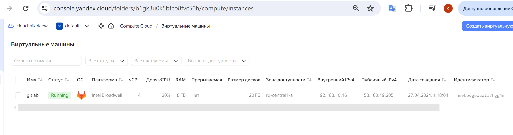
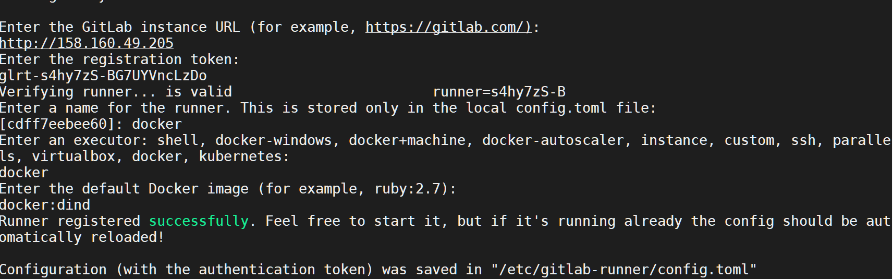
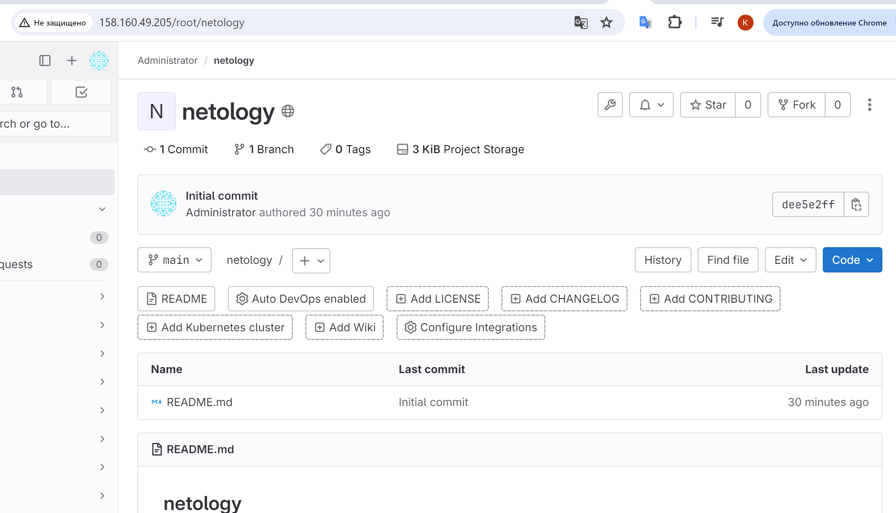
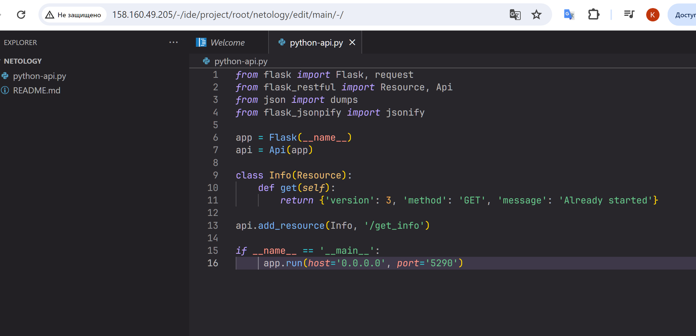
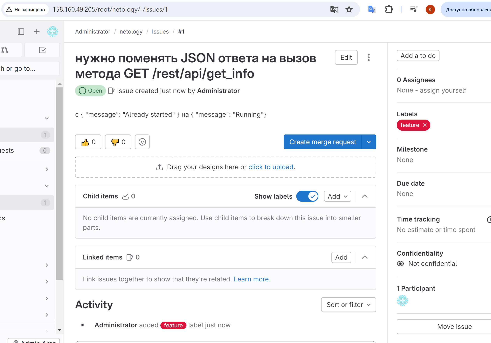
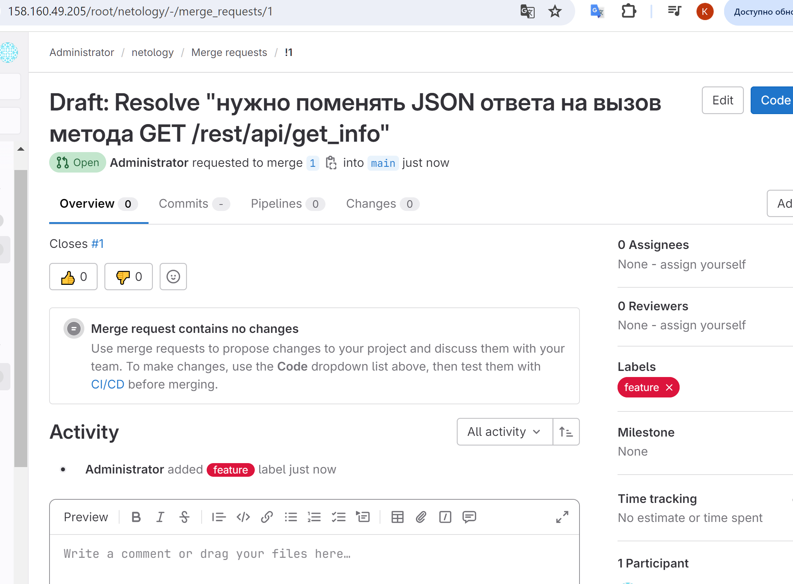
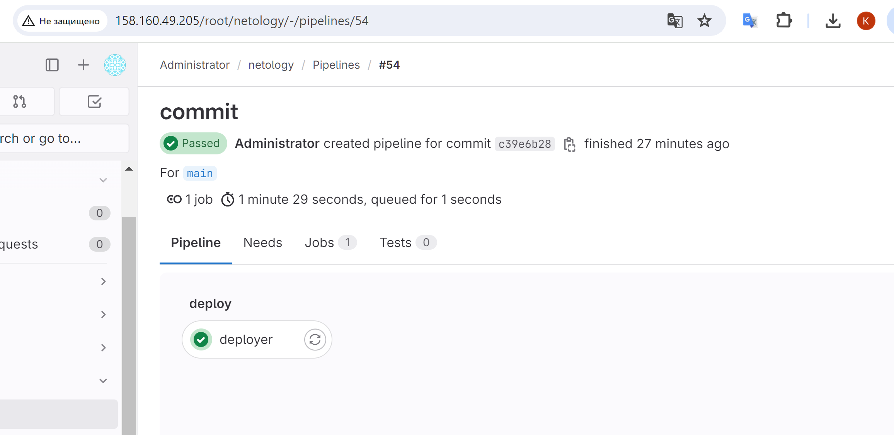
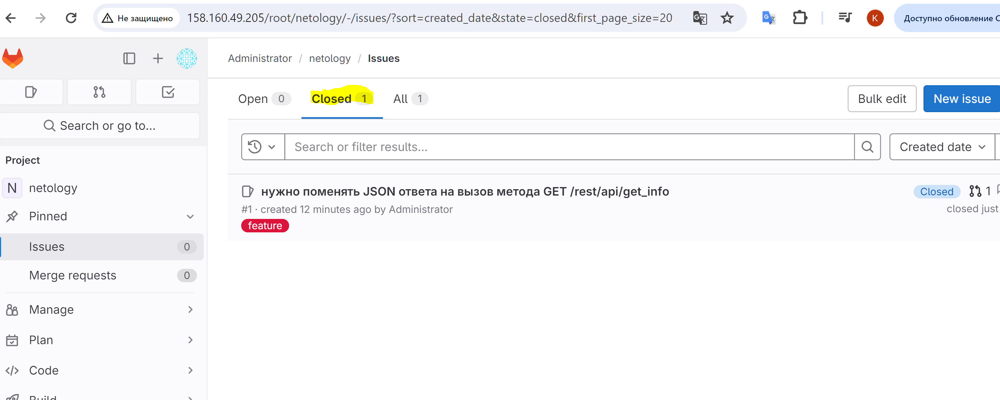

# Домашнее задание к занятию 12 «GitLab»

## Подготовка к выполнению


1. Или подготовьте к работе Managed GitLab от yandex cloud [по инструкции](https://cloud.yandex.ru/docs/managed-gitlab/operations/instance/instance-create) .
Или создайте виртуальную машину из публичного образа [по инструкции](https://cloud.yandex.ru/marketplace/products/yc/gitlab ) .

2. Создайте виртуальную машину и установите на нее gitlab runner, подключите к вашему серверу gitlab  [по инструкции](https://docs.gitlab.com/runner/install/linux-repository.html) .

3. (* Необязательное задание повышенной сложности. )  Если вы уже знакомы с k8s попробуйте выполнить задание, запустив gitlab server и gitlab runner в k8s  [по инструкции](https://cloud.yandex.ru/docs/tutorials/infrastructure-management/gitlab-containers). 

4. Создайте свой новый проект.



6. Создайте новый репозиторий в GitLab, наполните его [файлами](./repository).

7. Проект должен быть публичным, остальные настройки по желанию.

## Основная часть

### DevOps

В репозитории содержится код проекта на Python. Проект — RESTful API сервис. Ваша задача — автоматизировать сборку образа с выполнением python-скрипта:

1. Образ собирается на основе [centos:7](https://hub.docker.com/_/centos?tab=tags&page=1&ordering=last_updated).
2. Python версии не ниже 3.7.
3. Установлены зависимости: `flask` `flask-jsonpify` `flask-restful`.
4. Создана директория `/python_api`.
5. Скрипт из репозитория размещён в /python_api.
6. Точка вызова: запуск скрипта.
7. При комите в любую ветку должен собираться docker image с форматом имени hello:gitlab-$CI_COMMIT_SHORT_SHA . Образ должен быть выложен в Gitlab registry или yandex registry.   

### Product Owner

Вашему проекту нужна бизнесовая доработка: нужно поменять JSON ответа на вызов метода GET `/rest/api/get_info`, необходимо создать Issue в котором указать:

1. Какой метод необходимо исправить.
2. Текст с `{ "message": "Already started" }` на `{ "message": "Running"}`.
3. Issue поставить label: feature.



### Developer

Пришёл новый Issue на доработку, вам нужно:

1. Создать отдельную ветку, связанную с этим Issue.
2. Внести изменения по тексту из задания.
3. Подготовить Merge Request, влить необходимые изменения в `master`, проверить, что сборка прошла успешно.



### Tester

Разработчики выполнили новый Issue, необходимо проверить валидность изменений:

1. Поднять докер-контейнер с образом `python-api:latest` и проверить возврат метода на корректность.
2. Закрыть Issue с комментарием об успешности прохождения, указав желаемый результат и фактически достигнутый.

## Итог

В качестве ответа пришлите подробные скриншоты по каждому пункту задания:

- файл gitlab-ci.yml;
```shell
stages:
  - build
  - test
  - deploy
image: docker
services:
  - docker:dind
builder:
  stage: build
  script:
    - docker login -u $CI_REGISTRY_USER -p $CI_REGISTRY_PASSWORD $CI_REGISTRY
    - docker build -t ksenianikolaeva/devops-netology:gitlab-$CI_COMMIT_SHORT_SHA .
    - docker push ksenianikolaeva/devops-netology:gitlab-$CI_COMMIT_SHORT_SHA
  except:
    - main
deployer:
  stage: deploy
  script:
    - docker login -u $CI_REGISTRY_USER -p $CI_REGISTRY_PASSWORD $CI_REGISTRY
    - docker build -t ksenianikolaeva/devops-netology:latest .
    - docker push ksenianikolaeva/devops-netology:latest
  only:
    - main
```
- Dockerfile; 
```shell
FROM centos:7
ENV PYTHON_VERSION=3.7.5
EXPOSE 5290 5290

RUN yum install -y gcc openssl-devel bzip2-devel libffi libffi-devel curl wget make && \
    wget https://www.python.org/ftp/python/${PYTHON_VERSION}/Python-${PYTHON_VERSION}.tgz  && \
    tar -xzf Python-${PYTHON_VERSION}.tgz && rm Python-${PYTHON_VERSION}.tgz && \
    yum clean all && rm -rf /var/cache/yum/*

WORKDIR /Python-${PYTHON_VERSION}

RUN ./configure --enable-optimizations && \
    make altinstall && \
    ln -sf /usr/local/bin/python3.7 /usr/bin/python3 && \
    cd / && rm -rf /Python-${PYTHON_VERSION}

COPY requirements.txt /tmp/
RUN python3 -m pip install -r /tmp/requirements.txt

ADD python-api.py /python_api/python-api.py
ENTRYPOINT ["python3", "/python_api/python-api.py"]
```
- лог успешного выполнения пайплайна;

```shell
Running with gitlab-runner 16.11.0 (91a27b2a)
  on k-nikolaeva vMpfzywg7, system ID: s_09993649cc60
Preparing the "docker" executor
00:37
Using Docker executor with image docker ...
Starting service docker:dind ...
Pulling docker image docker:dind ...
Using docker image sha256:b53d90bb24113913e920d88247465f0196c54ea998a711e828260d9baf5de7ba for docker:dind with digest docker@sha256:66183ea9201de4ca3be95ea9f21235a6e427b50f632563e2761b13c0ad1bad48 ...
Waiting for services to be up and running (timeout 30 seconds)...
*** WARNING: Service runner-vmpfzywg7-project-1-concurrent-0-1aa749b9e0fc7215-docker-0 probably didn't start properly.
Health check error:
service "runner-vmpfzywg7-project-1-concurrent-0-1aa749b9e0fc7215-docker-0-wait-for-service" timeout
Health check container logs:
2024-04-27T21:17:41.861910184Z waiting for TCP connection to 172.17.0.2 on [2375 2376]...
2024-04-27T21:17:41.862054583Z dialing 172.17.0.2:2376...
2024-04-27T21:17:41.862157839Z dialing 172.17.0.2:2375...
2024-04-27T21:17:42.862748304Z dialing 172.17.0.2:2376...
2024-04-27T21:17:42.863031138Z dialing 172.17.0.2:2375...
2024-04-27T21:17:43.863412066Z dialing 172.17.0.2:2376...
2024-04-27T21:17:43.863461011Z dialing 172.17.0.2:2375...
2024-04-27T21:17:44.867265630Z dialing 172.17.0.2:2376...
2024-04-27T21:17:44.867496979Z dialing 172.17.0.2:2375...
Service container logs:
2024-04-27T21:17:42.127642213Z Certificate request self-signature ok
2024-04-27T21:17:42.128082807Z subject=CN = docker:dind server
2024-04-27T21:17:42.142295262Z /certs/server/cert.pem: OK
2024-04-27T21:17:44.386524392Z Certificate request self-signature ok
2024-04-27T21:17:44.386653769Z subject=CN = docker:dind client
2024-04-27T21:17:44.404004668Z /certs/client/cert.pem: OK
2024-04-27T21:17:44.406681051Z cat: can't open '/proc/net/ip6_tables_names': No such file or directory
2024-04-27T21:17:44.407332802Z cat: can't open '/proc/net/arp_tables_names': No such file or directory
2024-04-27T21:17:44.408884203Z iptables v1.8.10 (nf_tables)
2024-04-27T21:17:44.468258343Z time="2024-04-27T21:17:44.468013072Z" level=info msg="Starting up"
2024-04-27T21:17:44.469441305Z failed to load listeners: can't create unix socket /var/run/docker.sock: device or resource busy
*********
Pulling docker image docker ...
Using docker image sha256:b53d90bb24113913e920d88247465f0196c54ea998a711e828260d9baf5de7ba for docker with digest docker@sha256:66183ea9201de4ca3be95ea9f21235a6e427b50f632563e2761b13c0ad1bad48 ...
Preparing environment
00:00
Running on runner-vmpfzywg7-project-1-concurrent-0 via k-nikolaeva...
Getting source from Git repository
00:01
Fetching changes with git depth set to 20...
Reinitialized existing Git repository in /builds/root/netology/.git/
Checking out c39e6b28 as detached HEAD (ref is main)...
Skipping Git submodules setup
Executing "step_script" stage of the job script
00:51
Using docker image sha256:b53d90bb24113913e920d88247465f0196c54ea998a711e828260d9baf5de7ba for docker with digest docker@sha256:66183ea9201de4ca3be95ea9f21235a6e427b50f632563e2761b13c0ad1bad48 ...
$ docker login -u $CI_REGISTRY_USER -p $CI_REGISTRY_PASSWORD $CI_REGISTRY
WARNING! Using --password via the CLI is insecure. Use --password-stdin.
WARNING! Your password will be stored unencrypted in /root/.docker/config.json.
Configure a credential helper to remove this warning. See
https://docs.docker.com/engine/reference/commandline/login/#credentials-store
Login Succeeded
$ docker build -t ksenianikolaeva/devops-netology:latest .
#0 building with "default" instance using docker driver
#1 [internal] load build definition from Dockerfile
#1 transferring dockerfile: 793B done
#1 DONE 0.0s
#2 [internal] load metadata for docker.io/library/centos:7
#2 ...
#3 [auth] library/centos:pull token for registry-1.docker.io
#3 DONE 0.0s
#2 [internal] load metadata for docker.io/library/centos:7
#2 DONE 1.5s
#4 [internal] load .dockerignore
#4 transferring context: 2B done
#4 DONE 0.0s
#5 [1/7] FROM docker.io/library/centos:7@sha256:be65f488b7764ad3638f236b7b515b3678369a5124c47b8d32916d6487418ea4
#5 DONE 0.0s
#6 [internal] load build context
#6 transferring context: 70B done
#6 DONE 0.0s
#7 [4/7] RUN ./configure --enable-optimizations &&     make altinstall &&     ln -sf /usr/local/bin/python3.7 /usr/bin/python3 &&     cd / && rm -rf /Python-3.7.5
#7 CACHED
#8 [2/7] RUN yum install -y gcc openssl-devel bzip2-devel libffi libffi-devel curl wget make &&     wget https://www.python.org/ftp/python/3.7.5/Python-3.7.5.tgz  &&     tar -xzf Python-3.7.5.tgz && rm Python-3.7.5.tgz &&     yum clean all && rm -rf /var/cache/yum/*
#8 CACHED
#9 [5/7] COPY requirements.txt /tmp/
#9 CACHED
#10 [6/7] RUN python3 -m pip install -r /tmp/requirements.txt
#10 CACHED
#11 [3/7] WORKDIR /Python-3.7.5
#11 CACHED
#12 [7/7] ADD python-api.py /python_api/python-api.py
#12 CACHED
#13 exporting to image
#13 exporting layers done
#13 writing image sha256:156d0cd26bf8c4096abcc820ea056f361d8dde3ed68bca96fb1818802823ace3 done
#13 naming to docker.io/ksenianikolaeva/devops-netology:latest done
#13 DONE 0.0s
$ docker push ksenianikolaeva/devops-netology:latest
The push refers to repository [docker.io/ksenianikolaeva/devops-netology]
2f8fc7a9de9c: Preparing
5646aa2b7e7b: Preparing
c2609242d0e6: Preparing
f4ba94018aef: Preparing
5f70bf18a086: Preparing
e8eba1d7249c: Preparing
174f56854903: Preparing
e8eba1d7249c: Waiting
174f56854903: Waiting
5f70bf18a086: Pushed
c2609242d0e6: Pushed
2f8fc7a9de9c: Pushed
5646aa2b7e7b: Pushed
e8eba1d7249c: Pushed
f4ba94018aef: Pushed
174f56854903: Pushed
latest: digest: sha256:1cf5a1b77549c788374b9f99c9549b180bfefb638f992d80a98f2f103a7c6168 size: 1784
Job succeeded
```
- решённый Issue.

### Важно 
После выполнения задания выключите и удалите все задействованные ресурсы в Yandex Cloud.
